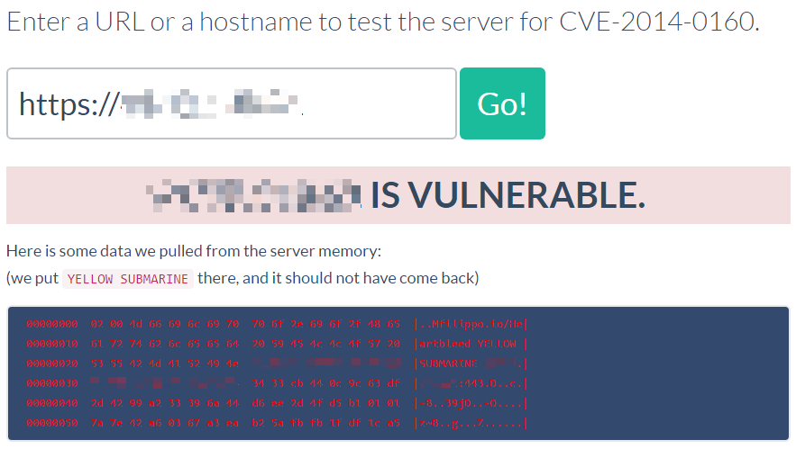
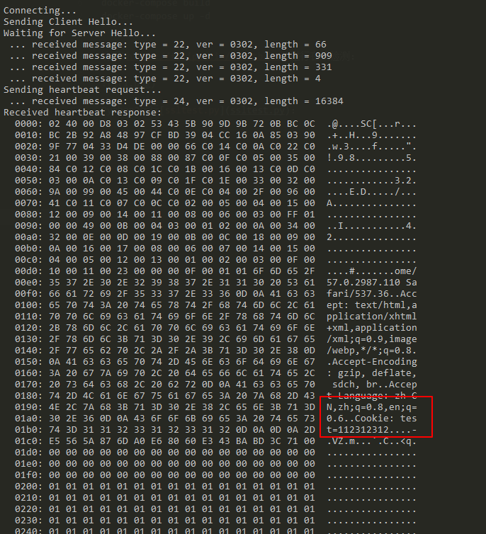

# OpenSSL 心脏出血内存泄露漏洞（CVE-2014-0160）

心脏出血是 OpenSSL 库中的一个内存漏洞，攻击者利用这个漏洞可以服务到目标进程内存信息，如其他人的 Cookie 等敏感信息。

参考链接：

- https://heartbleed.com/
- https://filippo.io/Heartbleed

## 环境搭建

运行如下命令启动一个使用了 OpenSSL 1.0.1c 的 Nginx 服务器：

```
docker compose up -d
```

环境启动后，访问 `https://your-ip:8443` 即可查看到 hello 页面（需要忽略 https 错误）。

> 我们在运行这个环境的时候遇到过一个错误，部分 AMD 架构的 CPU 无法成功访问 https 页面，如果你也遇到过类似的问题，可以换 Intel CPU 试试。

## 漏洞复现

访问 <https://filippo.io/Heartbleed> 进行在线检测：



Python 运行 [ssltest.py](ssltest.py)，拿到敏感数据（Cookie）：


