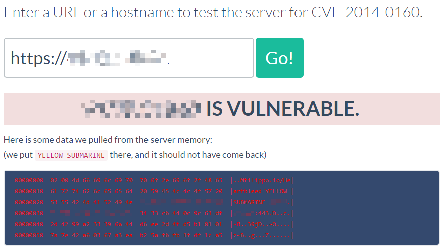

# OpenSSL 心脏出血漏洞（CVE-2014-0160）

心脏出血是OpenSSL库中的一个内存漏洞，攻击者利用这个漏洞可以服务到目标进程内存信息，如其他人的Cookie等敏感信息。

参考链接：

- https://heartbleed.com/
- https://filippo.io/Heartbleed

## 环境搭建

运行如下命令启动一个使用了OpenSSL 1.0.1c的Nginx服务器：

```
docker-compose up -d
```

环境启动后，访问`https://your-ip:8443`即可查看到hello页面（需要忽略https错误）。

> 我们在运行这个环境的时候遇到过一个错误，部分AMD架构的CPU无法成功访问https页面，如果你也遇到过类似的问题，可以换Intel CPU试试。

## 漏洞复现

访问<https://filippo.io/Heartbleed>进行在线检测：



Python运行[ssltest.py](ssltest.py)，拿到敏感数据（Cookie）：


