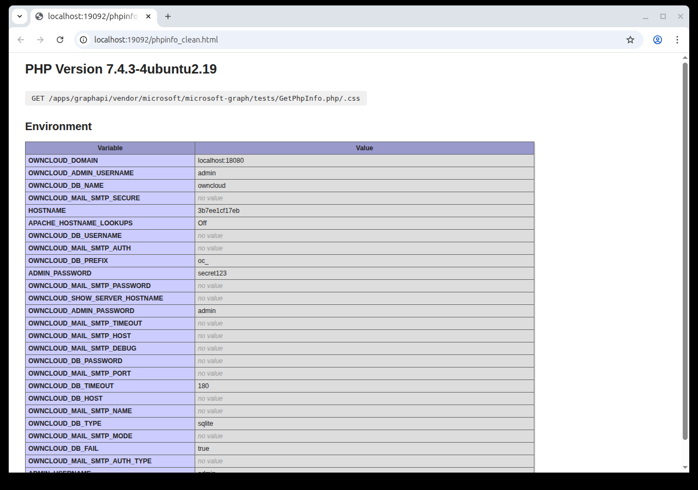

# ownCloud graphapi Information Disclosure (CVE-2023-49103)

[中文版本(Chinese version)](README.zh-cn.md)

[ownCloud](https://owncloud.com/) is an open-source file sync and share platform for managing and accessing files from anywhere.

CVE-2023-49103 is a critical information disclosure vulnerability in ownCloud's graphapi app, affecting versions 0.2.0 through 0.3.0. The graphapi app ships with a third-party library that includes a `GetPhpInfo.php` test file. This file calls `phpinfo()` and exposes it through a URL endpoint. In containerized deployments, this leads to the disclosure of all environment variables configured for the web server, which typically include sensitive credentials such as the ownCloud admin password, database credentials, mail server credentials, and object storage access keys. The vulnerability can be exploited without authentication by bypassing the `.htaccess` URL rewrite rules.

References:

- <https://owncloud.com/security-advisories/disclosure-of-sensitive-credentials-and-configuration-in-containerized-deployments/>
- <https://nvd.nist.gov/vuln/detail/CVE-2023-49103>

## Environment Setup

Execute the following command to start ownCloud 10.12:

```
docker compose up -d
```

After the server starts, visit `http://your-ip:8080` to access the ownCloud login page.

## Vulnerability Reproduction

The vulnerable endpoint is located at `/apps/graphapi/vendor/microsoft/microsoft-graph/tests/GetPhpInfo.php`. Since ownCloud's `.htaccess` uses URL rewrite rules to route all non-static-file requests through its front controller, the `GetPhpInfo.php` file cannot be accessed directly. However, by appending `/.css` to the URL, the rewrite condition that checks for static file extensions is satisfied, causing Apache to bypass the front controller and serve the PHP file directly.

Send the following request to access the `phpinfo()` output:

```
GET /apps/graphapi/vendor/microsoft/microsoft-graph/tests/GetPhpInfo.php/.css HTTP/1.1
Host: your-ip:8080
```



The response contains the full `phpinfo()` output. In the "Environment" section, sensitive credentials passed as Docker environment variables are visible in plain text, including `ADMIN_USERNAME`, `ADMIN_PASSWORD`, `OWNCLOUD_DB_PASSWORD`, and other configuration secrets.
