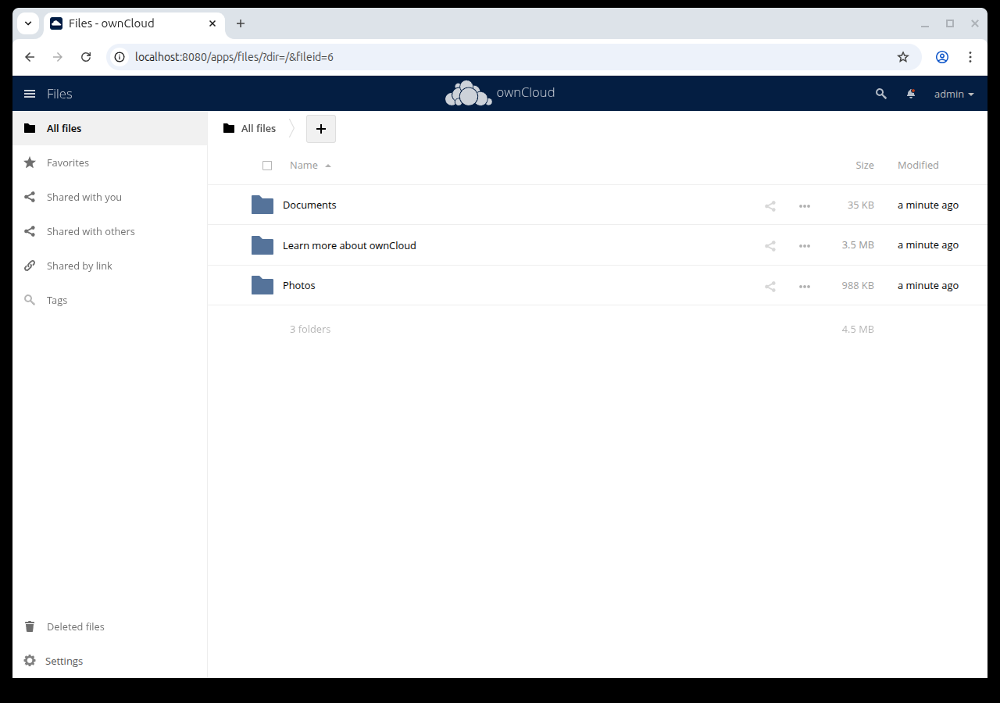

# ownCloud graphapi 信息泄露漏洞（CVE-2023-49103）

[ownCloud](https://owncloud.com/) 是一个开源的文件同步与共享平台，用于从任何地方管理和访问文件。

graphapi 是 ownCloud Server 自 10.6 版本起内置的一个 Microsoft Graph API 扩展应用，用于提供用户和组信息接口，以支持 ownCloud Server 10 与 ownCloud Infinite Scale 之间的桥接部署。CVE-2023-49103 是该应用中的一个严重信息泄露漏洞，影响 graphapi 0.2.0 至 0.3.0 版本。由于 graphapi 随 ownCloud Server 预装，根据官方公告，所有低于 10.13.3 版本的 ownCloud Server 实例均受影响。graphapi 的修复版本为 0.3.1，官方建议升级到至少 10.13.3 版本。

graphapi 应用依赖的一个第三方库中包含了一个 `GetPhpInfo.php` 测试文件，该文件调用了 `phpinfo()` 并通过 URL 暴露。在容器化部署中，这将导致 Web 服务器所有环境变量被泄露，通常包括 ownCloud 管理员密码、数据库凭据、邮件服务器凭据和对象存储访问密钥等敏感信息。攻击者无需认证即可通过绕过 `.htaccess` 的 URL 重写规则来利用该漏洞。

参考链接：

- <https://owncloud.com/security-advisories/disclosure-of-sensitive-credentials-and-configuration-in-containerized-deployments/>
- <https://nvd.nist.gov/vuln/detail/CVE-2023-49103>

## 环境搭建

执行如下命令启动 ownCloud 10.12.1：

```
docker compose up -d
```

服务启动后，访问 `http://your-ip:8080` 即可看到 ownCloud 登录页面。

## 漏洞复现

漏洞端点位于 `/apps/graphapi/vendor/microsoft/microsoft-graph/tests/GetPhpInfo.php`。由于 ownCloud 的 `.htaccess` 使用 URL 重写规则将所有非静态文件请求路由到前端控制器，因此无法直接访问该 PHP 文件。但通过在 URL 末尾追加 `/.css`，可以满足重写条件中对静态文件扩展名的检测，使 Apache 绕过前端控制器直接执行该 PHP 文件。

发送如下请求访问 `phpinfo()` 输出：

```
GET /apps/graphapi/vendor/microsoft/microsoft-graph/tests/GetPhpInfo.php/.css HTTP/1.1
Host: your-ip:8080
```


响应中包含完整的 `phpinfo()` 输出。在"Environment"部分，通过 Docker 环境变量传入的敏感凭据以明文形式可见，包括 `OWNCLOUD_ADMIN_USERNAME`、`OWNCLOUD_ADMIN_PASSWORD` 等配置信息。

利用泄露的 `OWNCLOUD_ADMIN_USERNAME` 和 `OWNCLOUD_ADMIN_PASSWORD`，攻击者可以登录 ownCloud 管理后台：


