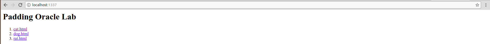
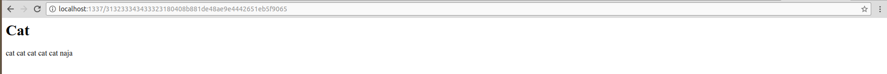
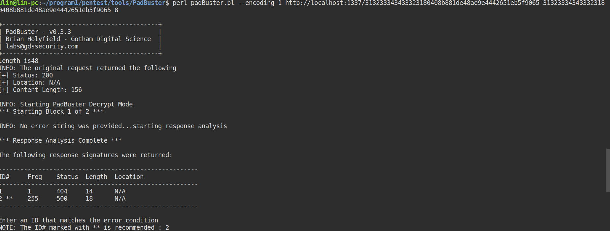
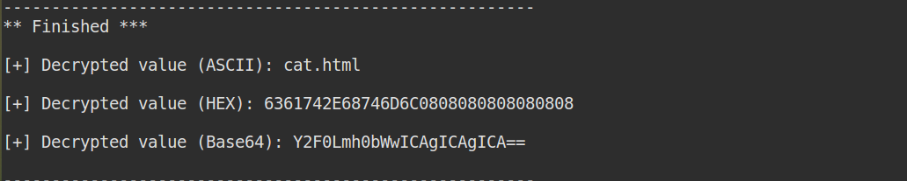

## 测试环境
测试环境参考Docker镜像bongtrop/padding-oracle-lab，代码有做修正。
```
docker-compose build
docker-compose up
```

## 原理
参考
- 《白帽子讲Web安全》
- [PKCS#7](https://www.di-mgt.com.au/cryptopad.html#PKCS5)
- [Padding Oracle](http://www.freebuf.com/articles/web/15504.html)

简单来说，CBC加密模式，遵循PKCS#7 Padding标准，Web应用会因解密结果不同产生不同的响应码，
恶意攻击者可以根据响应的不同进行边信道攻击，从而在有IV有密文，不知道加密KEY的情况下，获得明文.

## POC
访问[https://github.com/linsite/vulhub](http://localhost:1337),点击一个链接进入页面。页面中URL显示的是加密后的密文。将此链接COPY，


利用[Padbuster](https://github.com/GDSSecurity/PadBuster)工具进行攻击。即可得到明文。


