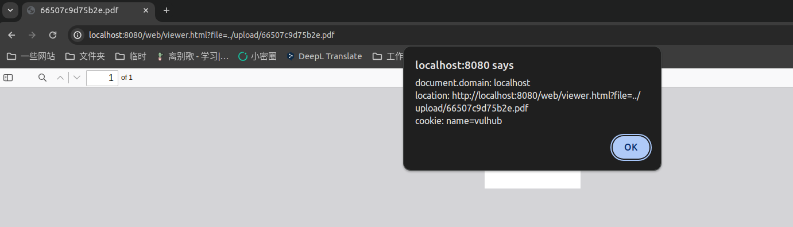

# PDF.js 任意JavaScript代码执行（CVE-2024-4367）

PDF.js是Mozilla推出的一款开源PDF文件阅读器。

其4.1.392版本及以前，PDF.js中存在一处JavaScript代码注入漏洞。

参考链接：

- <https://codeanlabs.com/blog/research/cve-2024-4367-arbitrary-js-execution-in-pdf-js/>

## 漏洞环境

执行如下命令启动一个使用了PDF.js 4.1.392的服务器：

```
docker compose up -d
```

服务启动后，访问`http://your-ip:8080`你可以看到一个上传页面。

## 漏洞复现

上传恶意PDF文件[poc.pdf](poc.pdf)，即可触发XSS弹窗：


