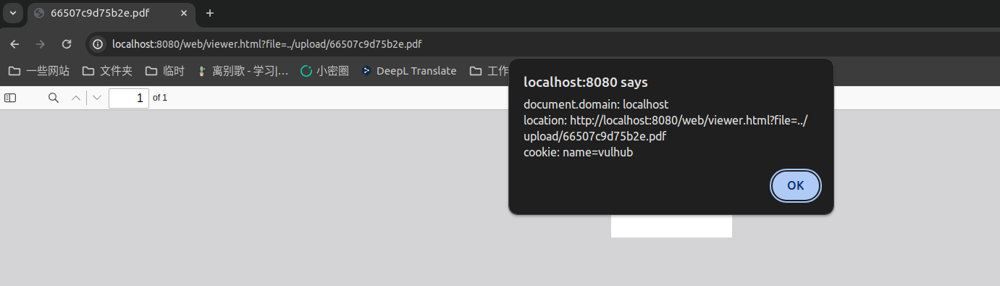

# PDF.js 任意 JavaScript 代码执行（CVE-2024-4367）

PDF.js 是 Mozilla 推出的一款开源 PDF 文件阅读器。

其 4.1.392 版本及以前，PDF.js 中存在一处 JavaScript 代码注入漏洞。

参考链接：

- <https://codeanlabs.com/blog/research/cve-2024-4367-arbitrary-js-execution-in-pdf-js/>

## 漏洞环境

执行如下命令启动一个使用了 PDF.js 4.1.392 的服务器：

```
docker compose up -d
```

服务启动后，访问 `http://your-ip:8080` 你可以看到一个上传页面。

## 漏洞复现

上传恶意 PDF 文件 [poc.pdf](poc.pdf)，即可触发 XSS 弹窗：


