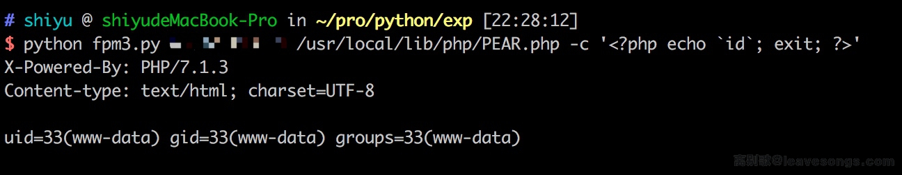

# PHP-FPM Fastcgi 未授权访问漏洞

## 原理

详见<https://www.leavesongs.com/PENETRATION/fastcgi-and-php-fpm.html>。

## 测试环境搭建

直接执行`docker-compose up -d`即可运行测试环境，环境监听9000端口。

## EXP

Exp见 https://gist.github.com/phith0n/9615e2420f31048f7e30f3937356cf75

执行结果：

