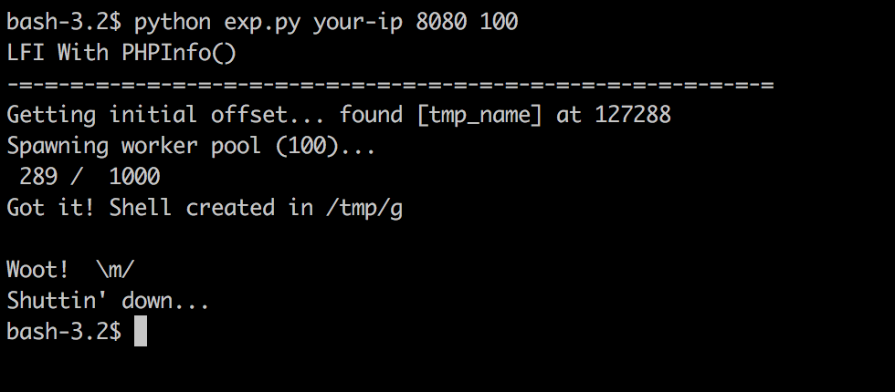
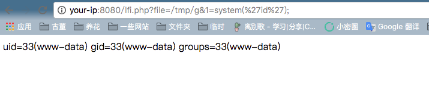

# PHP文件包含漏洞（利用phpinfo）

PHP文件包含漏洞中，如果找不到可以包含的文件，我们可以通过包含临时文件的方法来getshell。因为临时文件名是随机的，如果目标网站上存在phpinfo，则可以通过phpinfo来获取临时文件名，进而进行包含。

参考链接：

- https://dl.packetstormsecurity.net/papers/general/LFI_With_PHPInfo_Assitance.pdf

## 漏洞环境

执行如下命令启动环境：

```
docker-compose up -d
```

目标环境是官方最新版PHP7.2，说明该漏洞与PHP版本无关。

环境启动后，访问`http://your-ip:8080/phpinfo.php`即可看到一个PHPINFO页面，访问`http://your-ip:8080/lfi.php?file=/etc/passwd`，可见的确存在文件包含漏洞。

## 利用方法简述

在给PHP发送POST数据包时，如果数据包里包含文件区块，无论你访问的代码中有没有处理文件上传的逻辑，PHP都会将这个文件保存成一个临时文件（通常是`/tmp/php[6个随机字符]`），文件名可以在`$_FILES`变量中找到。这个临时文件，在请求结束后就会被删除。

同时，因为phpinfo页面会将当前请求上下文中所有变量都打印出来，所以我们如果向phpinfo页面发送包含文件区块的数据包，则即可在返回包里找到`$_FILES`变量的内容，自然也包含临时文件名。

在文件包含漏洞找不到可利用的文件时，即可利用这个方法，找到临时文件名，然后包含之。

但文件包含漏洞和phpinfo页面通常是两个页面，理论上我们需要先发送数据包给phpinfo页面，然后从返回页面中匹配出临时文件名，再将这个文件名发送给文件包含漏洞页面，进行getshell。在第一个请求结束时，临时文件就被删除了，第二个请求自然也就无法进行包含。

这个时候就需要用到条件竞争，具体流程如下：

1. 发送包含了webshell的上传数据包给phpinfo页面，这个数据包的header、get等位置需要塞满垃圾数据
2. 因为phpinfo页面会将所有数据都打印出来，1中的垃圾数据会将整个phpinfo页面撑得非常大
3. php默认的输出缓冲区大小为4096，可以理解为php每次返回4096个字节给socket连接
4. 所以，我们直接操作原生socket，每次读取4096个字节。只要读取到的字符里包含临时文件名，就立即发送第二个数据包
5. 此时，第一个数据包的socket连接实际上还没结束，因为php还在继续每次输出4096个字节，所以临时文件此时还没有删除
6. 利用这个时间差，第二个数据包，也就是文件包含漏洞的利用，即可成功包含临时文件，最终getshell

## 漏洞复现

利用脚本[exp.py](exp.py)实现了上述过程，成功包含临时文件后，会执行`<?php file_put_contents('/tmp/g', '<?=eval($_REQUEST[1])?>')?>`，写入一个新的文件`/tmp/g`，这个文件就会永久留在目标机器上。

用python2执行：`python exp.py your-ip 8080 100`：



可见，执行到第289个数据包的时候就写入成功。然后，利用lfi.php，即可执行任意命令：


