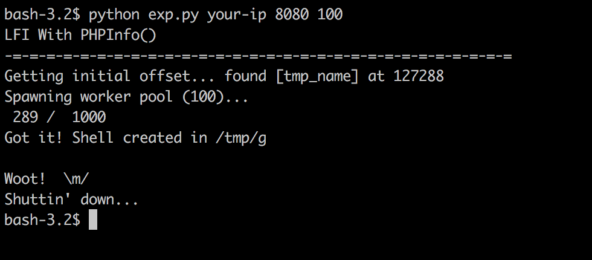
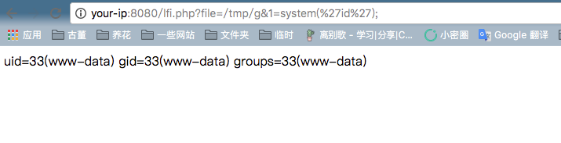

# PHP 文件包含漏洞（利用 phpinfo）

PHP 文件包含漏洞中，如果找不到可以包含的文件，我们可以通过包含临时文件的方法来 getshell。因为临时文件名是随机的，如果目标网站上存在 phpinfo，则可以通过 phpinfo 来获取临时文件名，进而进行包含。

参考链接：

- https://dl.packetstormsecurity.net/papers/general/LFI_With_PHPInfo_Assitance.pdf

## 漏洞环境

执行如下命令启动环境：

```
docker compose up -d
```

目标环境是官方最新版 PHP7.2，说明该漏洞与 PHP 版本无关。

环境启动后，访问 `http://your-ip:8080/phpinfo.php` 即可看到一个 PHPINFO 页面，访问 `http://your-ip:8080/lfi.php?file=/etc/passwd`，可见的确存在文件包含漏洞。

## 利用方法简述

在给 PHP 发送 POST 数据包时，如果数据包里包含文件区块，无论你访问的代码中有没有处理文件上传的逻辑，PHP 都会将这个文件保存成一个临时文件（通常是 `/tmp/php[6个随机字符]`），文件名可以在 `$_FILES` 变量中找到。这个临时文件，在请求结束后就会被删除。

同时，因为 phpinfo 页面会将当前请求上下文中所有变量都打印出来，所以我们如果向 phpinfo 页面发送包含文件区块的数据包，则即可在返回包里找到 `$_FILES` 变量的内容，自然也包含临时文件名。

在文件包含漏洞找不到可利用的文件时，即可利用这个方法，找到临时文件名，然后包含之。

但文件包含漏洞和 phpinfo 页面通常是两个页面，理论上我们需要先发送数据包给 phpinfo 页面，然后从返回页面中匹配出临时文件名，再将这个文件名发送给文件包含漏洞页面，进行 getshell。在第一个请求结束时，临时文件就被删除了，第二个请求自然也就无法进行包含。

这个时候就需要用到条件竞争，具体流程如下：

1. 发送包含了 webshell 的上传数据包给 phpinfo 页面，这个数据包的 header、get 等位置需要塞满垃圾数据
2. 因为 phpinfo 页面会将所有数据都打印出来，1 中的垃圾数据会将整个 phpinfo 页面撑得非常大
3. php 默认的输出缓冲区大小为 4096，可以理解为 php 每次返回 4096 个字节给 socket 连接
4. 所以，我们直接操作原生 socket，每次读取 4096 个字节。只要读取到的字符里包含临时文件名，就立即发送第二个数据包
5. 此时，第一个数据包的 socket 连接实际上还没结束，因为 php 还在继续每次输出 4096 个字节，所以临时文件此时还没有删除
6. 利用这个时间差，第二个数据包，也就是文件包含漏洞的利用，即可成功包含临时文件，最终 getshell

## 漏洞复现

利用脚本 [exp.py](exp.py) 实现了上述过程，成功包含临时文件后，会执行 `<?php file_put_contents('/tmp/g', '<?=eval($_REQUEST[1])?>')?>`，写入一个新的文件 `/tmp/g`，这个文件就会永久留在目标机器上。

用 python2 执行：`python exp.py your-ip 8080 100`：



可见，执行到第 289 个数据包的时候就写入成功。然后，利用 lfi.php，即可执行任意命令：


