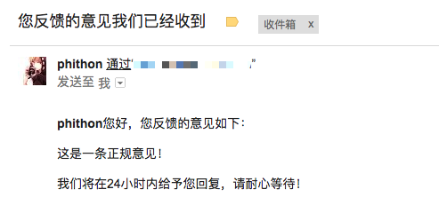
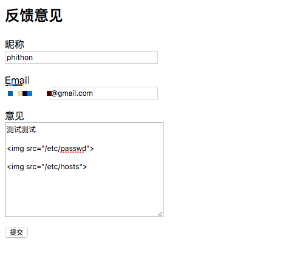
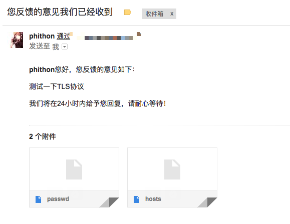

# PHPMailer 任意文件读取漏洞（CVE-2017-5223）

## 漏洞原理

PHPMailer在发送邮件的过程中，会在邮件内容中寻找图片标签（``），并将其src属性的值提取出来作为附件。所以，如果我们能控制部分邮件内容，可以利用``将文件`/etc/passwd`作为附件读取出来，造成任意文件读取漏洞。

 - http://www.freebuf.com/vuls/124820.html
 - https://www.exploit-db.com/exploits/43056/

## 漏洞环境

在当前目录下创建文件`.env`，内容如下（将其中的配置值修改成你的smtp服务器、账户、密码）：

```
SMTP_SERVER=smtp.example.com
SMTP_PORT=587
SMTP_EMAIL=your_email@example.com
SMTP_PASSWORD=secret
SMTP_SECURE=tls
```

其中，`SMTP_SECURE`是SMTP加密方式，可以填写none、ssl或tls。

然后编译、运行测试环境：

```
docker-compose build
docker-compose up -d
```

环境启动后，访问`http://your-ip:8080/`，即可看到一个“意见反馈”页面。

## 漏洞复现

“意见反馈”页面，正常用户填写昵称、邮箱、意见提交，这些信息将被后端储存，同时后端会发送一封邮件提示用户意见填写完成：



> 该场景在实战中很常见，比如用户注册网站成功后，通常会收到一封包含自己昵称的通知邮件，那么，我们在昵称中插入恶意代码``，目标服务器上的文件将以附件的形式被读取出来。

同样，我们填写恶意代码在“意见”的位置：



收到邮件，其中包含附件`/etc/passwd`和`/etc/hosts`：



下载读取即可。
