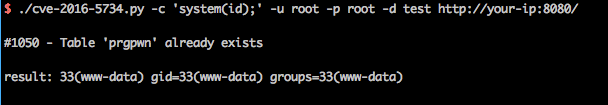

# phpMyAdmin 4.0.x—4.6.2 远程代码执行漏洞（CVE-2016-5734）

phpMyAdmin是一套开源的、基于Web的MySQL数据库管理工具。在其查找并替换字符串功能中，将用户输入的信息拼接进`preg_replace`函数第一个参数中。

在PHP5.4.7以前，`preg_replace`的第一个参数可以利用\0进行截断，并将正则模式修改为e。众所周知，e模式的正则支持执行代码，此时将可构造一个任意代码执行漏洞。

以下版本受到影响：

- 4.0.10.16之前4.0.x版本
- 4.4.15.7之前4.4.x版本
- 4.6.3之前4.6.x版本（实际上由于该版本要求PHP5.5+，所以无法复现本漏洞）

## 环境搭建

运行如下命令启动PHP 5.3 + Apache + phpMyAdmin 4.4.15.6：

```
docker-compose up -d 
```

启动后，访问`http://your-ip:8080`，即可看到phpMyAdmin的登录页面。使用`root`:`root`登录。

## 漏洞复现

这个功能需要登录，且能够写入数据。

因为目标环境使用root，所以我们可以创建一个临时数据库和数据表，进行漏洞利用。这里，我们使用POC https://www.exploit-db.com/exploits/40185/ 来复现漏洞。

```
./cve-2016-5734.py -c 'system(id);' -u root -p root -d test http://your-ip:8080/
```



-d是已经可以写的数据库，-c是待执行的PHP语句，如果没有指定表名，这个POC会创建一个名为`prgpwn`的表。
