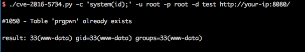

# phpMyAdmin 4.0.x—4.6.2 远程代码执行漏洞（CVE-2016-5734）

phpMyAdmin 是一套开源的、基于 Web 的 MySQL 数据库管理工具。在其查找并替换字符串功能中，将用户输入的信息拼接进 `preg_replace` 函数第一个参数中。

在 PHP5.4.7 以前，`preg_replace` 的第一个参数可以利用\0进行截断，并将正则模式修改为 e。众所周知，e 模式的正则支持执行代码，此时将可构造一个任意代码执行漏洞。

以下版本受到影响：

- 4.0.10.16 之前 4.0.x 版本
- 4.4.15.7 之前 4.4.x 版本
- 4.6.3 之前 4.6.x 版本（实际上由于该版本要求 PHP5.5+，所以无法复现本漏洞）

## 环境搭建

运行如下命令启动 PHP 5.3 + Apache + phpMyAdmin 4.4.15.6：

```
docker compose up -d 
```

启动后，访问 `http://your-ip:8080`，即可看到 phpMyAdmin 的登录页面。使用 `root`:`root` 登录。

## 漏洞复现

这个功能需要登录，且能够写入数据。

因为目标环境使用 root，所以我们可以创建一个临时数据库和数据表，进行漏洞利用。这里，我们使用 POC https://www.exploit-db.com/exploits/40185/ 来复现漏洞。

```
./cve-2016-5734.py -c 'system(id);' -u root -p root -d test http://your-ip:8080/
```



-d 是已经可以写的数据库，-c 是待执行的 PHP 语句，如果没有指定表名，这个 POC 会创建一个名为 `prgpwn` 的表。
