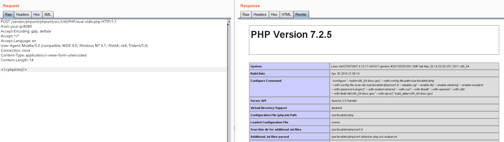

# PHPUnit Remote Code Execution (CVE-2017-9841)

[中文版本(Chinese version)](README.zh-cn.md)

PHPUnit is a programmer-oriented testing framework for PHP.

`Util/PHP/eval-stdin.php` in PHPUnit before 4.8.28 and 5.x before 5.6.3 allows remote attackers to execute arbitrary PHP code via HTTP POST data beginning with a `<?php` substring, as demonstrated by an attack on a site with an exposed /vendor folder, i.e., external access to the `/vendor/phpunit/phpunit/src/Util/PHP/eval-stdin.php` URI.

The `Util/PHP/eval-stdin.php`'s vulnerable code:

```php
eval('?>'.file_get_contents('php://input'));
```

Reference links:

- http://web.archive.org/web/20170701212357/http://phpunit.vulnbusters.com/
- https://www.ovh.com/blog/cve-2017-9841-what-is-it-and-how-do-we-protect-our-customers/

## Vulnerable environment

Execute following command to start a Apache web server, which contains the PHPUnit 5.6.2 in the Web directory.

```
docker-compose up -d
```

Open the `http://your-ip:8080` to see the index page util Web server is running.

## Exploit

Send the request to `http://your-ip:8080/vendor/phpunit/phpunit/src/Util/PHP/eval-stdin.php`, which contains any PHP code within the body:


