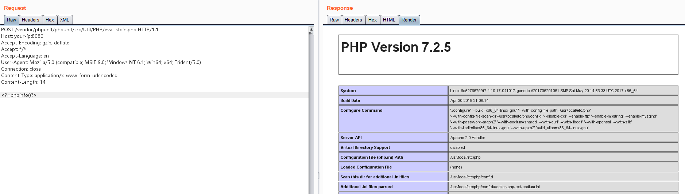

# phpunit 远程代码执行漏洞（CVE-2017-9841）

composer 是 php 包管理工具，使用 composer 安装扩展包将会在当前目录创建一个 vendor 文件夹，并将所有文件放在其中。通常这个目录需要放在 web 目录外，使用户不能直接访问。

phpunit 是 php 中的单元测试工具，其 4.8.19 ~ 4.8.27 和 5.0.10 ~ 5.6.2 版本的 `vendor/phpunit/phpunit/src/Util/PHP/eval-stdin.php` 文件有如下代码：

```php
eval('?>'.file_get_contents('php://input'));
```

如果该文件被用户直接访问到，将造成远程代码执行漏洞。

参考链接：

- http://web.archive.org/web/20170701212357/http://phpunit.vulnbusters.com/
- https://www.ovh.com/blog/cve-2017-9841-what-is-it-and-how-do-we-protect-our-customers/

## 漏洞环境

执行如下命令启动一个 php 环境，其中 phpunit 被安装在 web 目录下。

```
docker compose build
docker compose up -d
```

web 环境将启动在 `http://your-ip:8080`。

## 漏洞复现

直接将 PHP 代码作为 POST Body 发送给 `http://your-ip:8080/vendor/phpunit/phpunit/src/Util/PHP/eval-stdin.php`：


